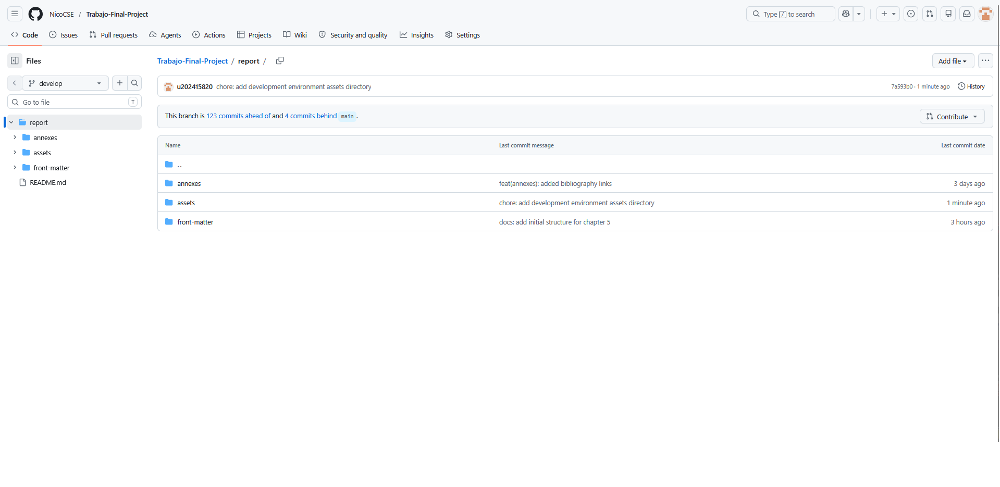
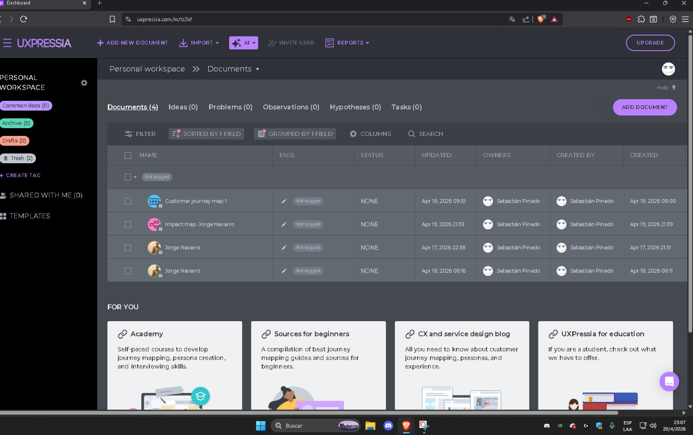
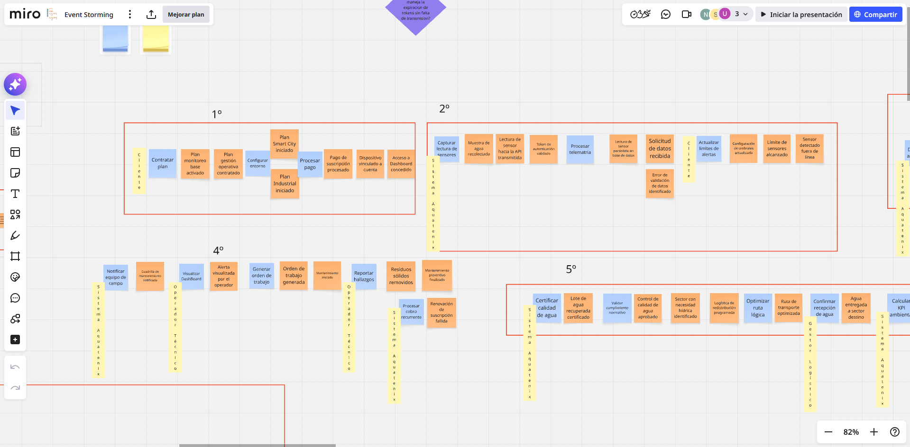
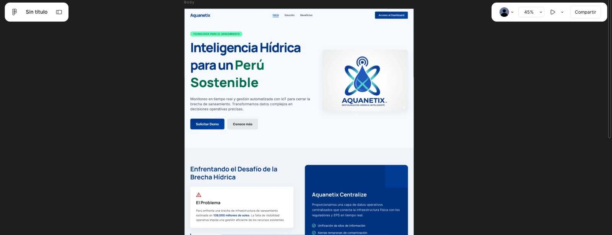
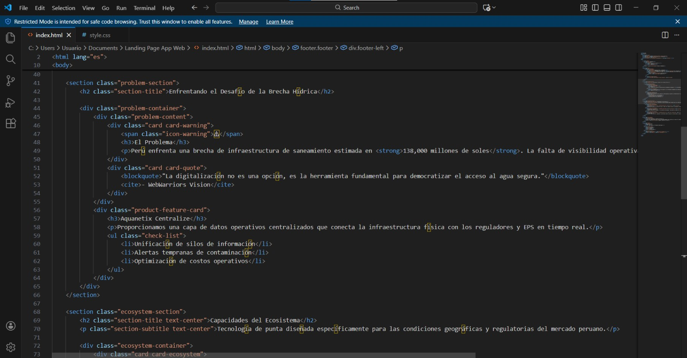
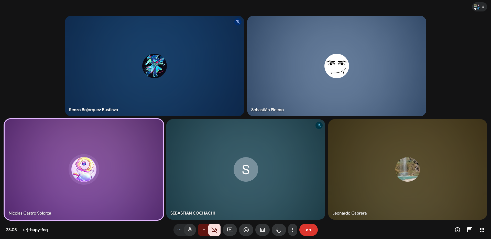
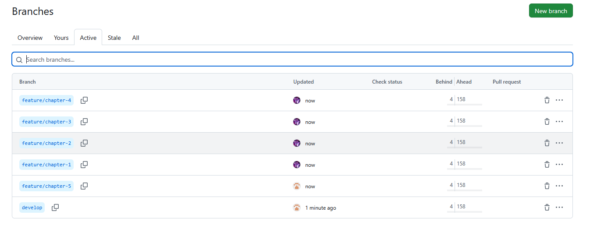
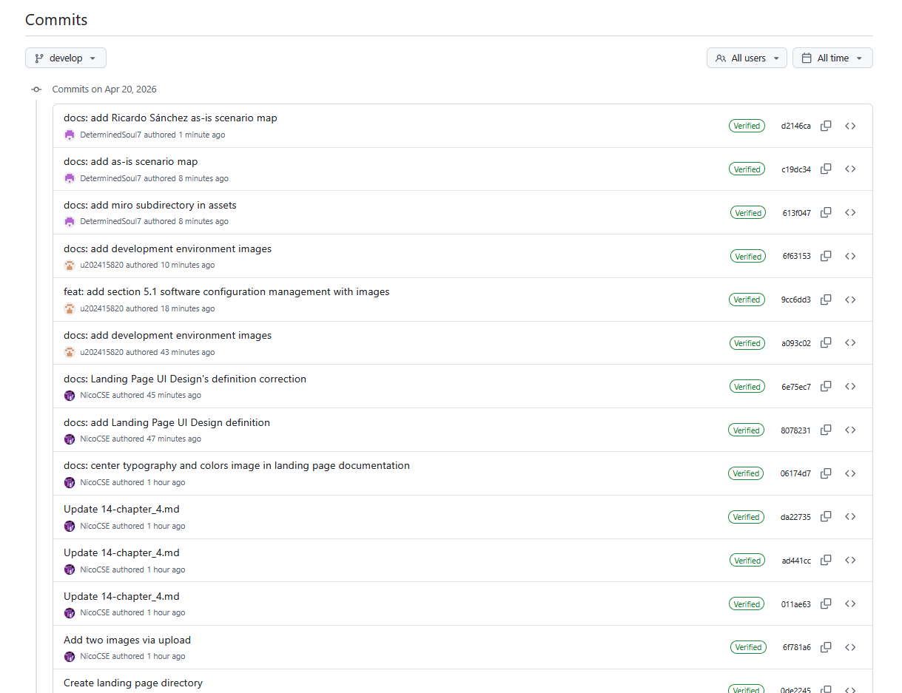

# Capítulo V: Product Implementation, Validation & Deployment.
## 5.1. Software Configuration Management.

Durante el desarrollo de la aplicación web, se gestionaron múltiples elementos como prototipos, documentación UX, código fuente y versiones del sistema. Para ello, se utilizaron herramientas colaborativas que facilitaron el trabajo en equipo y permitieron llevar un control adecuado de los cambios realizados.

### 5.1.1. Software Development Environment Configuration.

El entorno de desarrollo del proyecto fue configurado utilizando herramientas digitales basadas en la nube, las cuales permitieron el trabajo colaborativo y la integración de las distintas fases del desarrollo de la aplicación web.

### Github

Utilizado como repositorio principal para la gestión del código fuente, control de versiones y trabajo colaborativo entre los integrantes del equipo.

[GitHub](https://github.com/)

<p align="center">

</p>

### Uxpressia

Herramienta utilizada para la elaboración de entregables UX como user personas, mapas de empatía y customer journey.

[UXPressia](https://uxpressia.com/)

<p align="center">
  
</p>

### Miro

Plataforma empleada para la organización de ideas, diagramas, brainstorming y planificación del proyecto. Facilitó la estructuración inicial de la solución.

[Miro](https://miro.com/)

<p align="center">
  
</p>

### Figma

La herramienta empleada para la organización de ideas, diagramas, brainstorming y planificación del proyecto. Facilitó la estructuración inicial de la solución.

[Figma](https://www.figma.com/)

<p align="center">
  
</p>

### VSCode

Permitió trabajar de manera eficiente con archivos HTML, CSS y JavaScript, facilitando la organización del código, la edición en tiempo real y la integración con el repositorio del proyecto.

[VSCode](https://code.visualstudio.com/)

<p align="center">
  
</p>

### Meet

Herramienta de comunicación utilizada para la coordinación del equipo durante el desarrollo del proyecto. A través de reuniones virtuales, se realizaron seguimientos de avances, toma de decisiones y organización de tareas.

[Meet](https://meet.google.com/)

<p align="center">
  
</p>


## 5.1.2 Source Code Management

La gestión del código fuente del proyecto se realizó mediante la plataforma GitHub, la cual fue utilizada como sistema de control de versiones para organizar y dar seguimiento a todos los cambios realizados durante el desarrollo.

El proyecto cuenta con dos repositorios principales:

- **Repositorio del informe (documentación)**: https://github.com/NicoCSE/Aquanetix-report  
- **Repositorio de la Landing Page**: https://github.com/NicoCSE/Landing-Page-Aquanetix

En el repositorio del informe se gestionaron todos los avances relacionados a la documentación del proyecto, mientras que en el repositorio de la Landing Page se desarrolló la parte visual y funcional del producto.

### GitFlow Workflow

Para la organización del desarrollo se implementó el modelo GitFlow en una versión simplificada, permitiendo estructurar el trabajo del equipo mediante el uso de ramas.

Las ramas utilizadas en el proyecto fueron:

- **main**: contiene la versión estable y final del proyecto.  
- **develop**: rama principal de trabajo donde se integran los avances del equipo.  
- **feature/**: ramas utilizadas para el desarrollo de nuevas funcionalidades o secciones específicas del proyecto.  

La rama develop fue utilizada como base para el desarrollo continuo del proyecto, permitiendo consolidar los cambios provenientes de distintas ramas feature antes de integrarlos a la versión final.

### Convenciones de Ramas

Se estableció la siguiente convención para la creación de ramas:

<p align="center">
  
</p>

- **Feature branches**:  
  feature/nombre-funcionalidad  

Ejemplos reales del proyecto:

- feature/chapter-1  
- feature/chapter-2  
- feature/chapter-3  
- feature/chapter-4  
- feature/chapter-5  

Estas ramas permiten desarrollar funcionalidades o secciones de manera independiente sin afectar la estabilidad del proyecto.

### Semantic Versioning

Para el control de versiones del proyecto se adoptará el uso de Semantic Versioning (SemVer), siguiendo la estructura:

**vMAJOR.MINOR.PATCH**

Donde:
- **MAJOR**: cambios importantes o incompatibles  
- **MINOR**: nuevas funcionalidades  
- **PATCH**: corrección de errores  

Ejemplo:
**v1.0.0**  

Esto permite mantener un control claro sobre la evolución del proyecto.

### Conventional Commits

Para estandarizar los mensajes de commits, se aplicó la convención de Conventional Commits, lo que permitió mejorar la organización y trazabilidad del repositorio.

<p align="center">
  
</p>

<p align="center">
Historial de commits en la rama develop del repositorio, evidenciando el uso de Conventional Commits y el trabajo colaborativo del equipo.
</p>

La evidencia mostrada refleja el uso adecuado de Conventional Commits, así como la participación activa de los integrantes del equipo en el desarrollo del proyecto.

Los tipos de commits utilizados fueron:

- **feat**: nuevas funcionalidades  
- **docs**: cambios en documentación  
- **fix**: corrección de errores  
- **chore**: tareas menores o mantenimiento  

Ejemplos reales del proyecto:

- **feat**: add section 5.1 software configuration management with images  
- **docs**: add development environment images  
- **fix**: correct image path in markdown  
- **chore**: update repository structure  

El uso de estas convenciones permitió identificar fácilmente el tipo de cambio realizado en cada commit y mejorar la colaboración entre los integrantes del equipo.

## 5.1.3 Source Code Style Guide & Conventions

Con el objetivo de garantizar la consistencia, legibilidad y mantenibilidad del proyecto, el equipo definió una guía de estilo basada en las tecnologías actualmente utilizadas en el desarrollo de la Landing Page.

Esta guía establece estándares que permiten mantener un código limpio, organizado y comprensible para todos los integrantes del equipo.

### HTML

Para la estructura del documento HTML se establecieron las siguientes convenciones:

- Uso de etiquetas en minúsculas (lowercase)
- Correcto cierre de todos los elementos HTML
- Uso de etiquetas semánticas como `header`, `nav`, `main`, `section` y `footer`
- Inclusión de atributos `alt` en imágenes para mejorar la accesibilidad
- Estructuración jerárquica del contenido

Ejemplo:

```html
<section>
  <h1>Inteligencia Hídrica</h1>
  <p>Monitoreo en tiempo real</p>
</section>
```

### CSS

Para los estilos del sistema se definieron las siguientes convenciones:

- Uso de kebab-case para nombres de clases
- Nombres descriptivos según la funcionalidad del elemento
- Reutilización de clases para evitar duplicidad
- Separación de estilos en archivos independientes
- Organización de estilos personalizados en archivos CSS dedicados
Ejemplo:

```css
.water-shadow {
  box-shadow: 0 12px 32px rgba(0, 50, 125, 0.06);
}
```

### Uso de Tailwind CSS

Se empleó Tailwind CSS como framework de estilos utilitarios, permitiendo:

- Construcción rápida de interfaces  
- Diseño responsive  
- Consistencia visual en los componentes  

El uso de clases utilitarias permite reducir la cantidad de código CSS personalizado y mejorar la mantenibilidad del proyecto.

### 5.1.4. Software Deployment Configuration.

En esta sección se especifica la configuración y los pasos necesarios para el despliegue de los productos digitales de la solución Aquanetix. El despliegue se ha automatizado para garantizar que los cambios realizados en los repositorios de código fuente se reflejen de manera satisfactoria en los entornos de producción.

## Despliegue de la Landing Page

1. Se creo el repositorio en Github en la organizacion del equipo WebWarriors, coloco que sea de manera publica

2. Publicación Directa: El código fuente desarrollado en VS Code fue sincronizado directamente con la rama main mediante comandos de Git.

3. Hosting: La visualización del producto se gestiona a través de la infraestructura de GitHub, asegurando que el HTML y los estilos de Tailwind CSS sean accesibles de forma pública una vez realizado el push de los archivos.

## 5.2. Landing Page, Services & Applications Implementation.

### 5.2.1. Sprint 1

### 5.2.1.1. Sprint Planning 1.

<table border="1" cellpadding="6" cellspacing="0">
  <tr>
    <th>Sprint #</th>
    <td>Sprint n</td>
  </tr>

  <tr>
    <th colspan="2">Sprint Planning Background</th>
  </tr>

  <tr>
    <th>Date</th>
    <td>YYYY-MM-DD</td>
  </tr>

  <tr>
    <th>Time</th>
    <td>HH:MM AM/PM</td>
  </tr>

  <tr>
    <th>Location</th>
    <td>(Descripción de la ubicación de la reunión, física o virtual)</td>
  </tr>

  <tr>
    <th>Prepared By</th>
    <td>Jiménez Rosas, Arturo Eduardo</td>
  </tr>

  <tr>
    <th>Attendees (to planning meeting)</th>
    <td>Jiménez Rosas, Arturo Eduardo / Rodríguez Peña, Jorge Andrés / ...</td>
  </tr>

  <tr>
    <th>Sprint n − 1 Review Summary</th>
    <td>(Resumen del Sprint anterior, en términos de resultados alcanzados a nivel de productos de software, opiniones de miembros y feedback de product owner.)</td>
  </tr>

  <tr>
    <th>Sprint n − 1 Retrospective Summary</th>
    <td>(Resumen del Sprint anterior, en términos de opiniones de miembros del equipo sobre aciertos u oportunidades de mejora en su forma de trabajo)</td>
  </tr>

  <tr>
    <th colspan="2">Sprint Goal & User Stories</th>
  </tr>

  <tr>
    <th>Sprint n Goal</th>
    <td>(Definir el Goal del Sprint n y la métrica de cumplimiento.)</td>
  </tr>

  <tr>
    <th>Sprint n Velocity</th>
    <td>(Definir el Velocity establecido para el Sprint n, es decir cuántos Story Points puede aceptar el equipo para este Sprint n.)</td>
  </tr>

  <tr>
    <th>Sum of Story Points</th>
    <td>(Colocar la suma de los Story Points para los User Stories que se están incluyendo en este Sprint n.)</td>
  </tr>
</table>

### 5.2.1.2. Aspect Leaders and Collaborators.

<table border="1" cellpadding="6" cellspacing="0">
  <tr>
    <th>Team Member (Last Name, First Name)</th>
    <th>GitHub Username</th>
    <th>Aspect Name 1<br>Leader (L) / Collaborator (C)</th>
    <th>Aspect Name 2<br>Leader (L) / Collaborator (C)</th>
    <th>...</th>
    <th>Aspect Name n<br>Leader (L) / Collaborator (C)</th>
  </tr>

  <tr>
    <td>Jiménez Rosas, Arturo Eduardo</td>
    <td>ajimenezrosas</td>
    <td>L</td>
    <td>C</td>
    <td>...</td>
    <td></td>
  </tr>

  <tr>
    <td>Rodríguez Peña, Jorge Andrés</td>
    <td>Japr91</td>
    <td>C</td>
    <td>C</td>
    <td>...</td>
    <td>L</td>
  </tr>
</table>

### 5.2.1.3. Sprint Backlog 1.

<table border="1" cellpadding="6" cellspacing="0" style="border-collapse: collapse; text-align: center;">
  
  <!-- Sprint -->
  <tr>
    <th>Sprint #</th>
    <td colspan="7">Sprint n</td>
  </tr>

  <!-- Encabezados principales -->
  <tr>
    <th colspan="2">User Story</th>
    <th colspan="6">Work-Item / Task</th>
  </tr>

  <!-- Subencabezados -->
  <tr>
    <th>Id</th>
    <th>Title</th>
    <th>Id</th>
    <th>Title</th>
    <th>Description</th>
    <th>Estimation (Hours)</th>
    <th>Assigned To</th>
    <th>Status (To-do / In-Process / To-Review / Done)</th>
  </tr>

  <!-- Filas de ejemplo -->
  <tr>
    <td>US-01</td>
    <td>Lorem Ipsum</td>
    <td>T-01</td>
    <td>Diseñar UI</td>
    <td>Crear interfaz de login</td>
    <td>4</td>
    <td>Arturo</td>
    <td>To-do</td>
  </tr>

  <tr>
    <td>US-01</td>
    <td>Lorem Ipsum</td>
    <td>T-02</td>
    <td>Validación backend</td>
    <td>Implementar autenticación</td>
    <td>6</td>
    <td>Jorge</td>
    <td>In-Process</td>
  </tr>

  <tr>
    <td>US-02</td>
    <td>Lorem Ipsum</td>
    <td>T-03</td>
    <td>Formulario registro</td>
    <td>Crear formulario</td>
    <td>5</td>
    <td>Arturo</td>
    <td>Done</td>
  </tr>

</table>

### 5.2.1.4. Development Evidence for Sprint Review.

<table border="1" cellpadding="6" cellspacing="0" style="border-collapse: collapse;">
  
  <tr>
    <th>Repository</th>
    <th>Branch</th>
    <th>Commit Id</th>
    <th>Commit Message</th>
    <th>Commit Message Body</th>
    <th>Committed on (Date)</th>
  </tr>

  <tr>
    <td>user/repositoryname</td>
    <td>feature/loremipsum</td>
    <td>14ca4e3</td>
    <td>feat: consectetur adipiscing elit</td>
    <td>Curabitur quis placerat nulla. Fusce malesuada faucibus quam, ut condimentum velit rutrum ut.</td>
    <td>04/09/2021</td>
  </tr>

</table>

### 5.2.1.5. Execution Evidence for Sprint Review.


### 5.2.1.6. Services Documentation Evidence for Sprint Review.


### 5.2.1.7. Software Deployment Evidence for Sprint Review.


### 5.2.1.8. Team Collaboration Insights during Sprint


