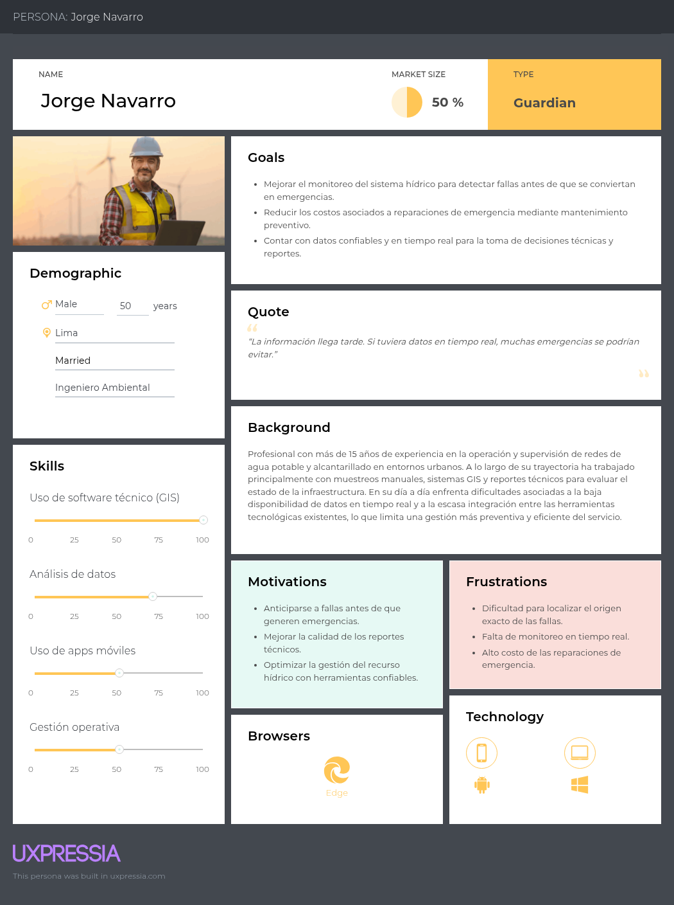

## 2.3. Needfinding
En esta sección, el equipo explica y presenta los artefactos resultantes del proceso de análisis de la información recolectada en las entrevistas y el análisis competitivo. A continuación, se detallan los User Personas, User Task Matrix, User Journey Maps, Empathy Mapping y As-Is Scenario Maps.

### 2.3.1. User Personas
En esta sección se presentan las fichas de los User Personas desarrolladas mediante la herramienta UXPressia. Para la elaboración de estos arquetipos, se han tomado en cuenta las principales características demográficas, tecnológicas y actitudinales extraídas del análisis estadístico de las entrevistas, así como las debilidades operativas identificadas. Se ha diseñado un arquetipo representativo por cada uno de nuestros segmentos objetivo: Empresas Prestadoras de Servicios y Empresas Gestoras de Residuos Sólidos.

#### Segmento 1: Empresas prestadoras de servicios de agua y alcantarillado

  

#### Segmento 2: Empresas gestoras de residuos sólidos

  

### 2.3.2. Task Matrix
A continuación, se presenta el User Task Matrix, el cual concentra las tareas fundamentales que nuestros arquetipos realizan diariamente para cumplir sus objetivos operativos, independientemente del uso de nuestra solución de software. En esta matriz se evalúa la frecuencia y la importancia de cada actividad para los dos segmentos considerados: Jorge Navarro (EPS) y Ricardo Sánchez (Gestión de Residuos Sólidos).

| Tareas (Tasks) | Jorge Navarro (EPS) - Frecuencia | Jorge Navarro (EPS) - Importancia | Ricardo Sánchez (Residuos) - Frecuencia | Ricardo Sánchez (Residuos) - Importancia |
| :--- | :--- | :--- | :--- | :--- |
| Monitoreo de calidad y niveles de agua en tiempo real | Muy alta | Muy alta | Muy alta | Muy alta |
| Revisión de alertas por variaciones u anomalías | Alta | Muy alta | Muy alta | Muy alta |
| Verificación del estado de los sensores en la red | Media | Alta | Alta | Muy alta |
| Coordinación de mantenimiento preventivo | Media | Alta | N/A | N/A |
| Detección temprana de fugas u obstrucciones | Alta | Muy alta | N/A | N/A |
| Generación de reportes operativos y ROI | Media | Media | Media | Alta |
| Ajuste de parámetros de reutilización y huella hídrica | N/A | N/A | Baja | Media |
| Consulta del historial de fallas por zona | Baja | Media | N/A | N/A |

Como se puede observar en la matriz, existe una coincidencia crítica en las tareas de mayor frecuencia e importancia para ambos arquetipos: el monitoreo constante de la calidad del agua, la revisión de alertas tempranas y la verificación del estado operativo de los sensores. Ambos usuarios dependen de esta información para evitar crisis y garantizar la continuidad de sus operaciones. 

La principal diferencia radica en las tareas subsecuentes. Jorge Navarro prioriza actividades de mitigación estructural, como la coordinación del mantenimiento preventivo y la detección de fallas físicas en la red pública. En contraste, Ricardo Sánchez se enfoca en la eficiencia logística y la rentabilidad, priorizando la generación de reportes de ahorro (ROI) y el ajuste de parámetros que habiliten la reutilización segura del agua para su flota.

### 2.3.3. Journey Mapping
En esta sección se presentan los User Journey Maps en su versión "As-Is", elaborados para cada uno de nuestros User Personas. Estos mapas ilustran el end-to-end journey que experimentan actualmente ambos usuarios al enfrentarse a sus actividades operativas diarias sin la existencia de la plataforma Aquanetix. El recorrido resume la experiencia desde el inicio de su jornada, pasando por las fricciones de la recolección manual de datos y la falta de información en tiempo real, hasta llegar a la toma de decisiones netamente reactivas frente a las emergencias.

#### User Persona 1: Jorge Navarro

  

#### User Persona 2: Ricardo Sánchez

  

### 2.3.4. Empathy Mapping
Para la construcción de los siguientes Empathy Maps, el equipo resumió el proceso de elaboración colocando a cada User Persona en el centro del análisis. Nos enfocamos en responder interrogantes clave basadas en la observación directa de nuestras entrevistas: ¿qué piensa y siente el usuario frente a sus retos diarios?, ¿qué oye en su entorno profesional?, ¿qué ve en sus herramientas actuales?, y ¿qué dice y hace al interactuar con su equipo y tecnología? A partir de estas respuestas, logramos identificar claramente sus mayores dolores (Pains), ligados a la ineficiencia logística y fallas no detectadas, así como sus principales ganancias (Gains), enfocadas en el ahorro y la automatización.

#### User Persona 1: Jorge Navarro

  

#### User Persona 2: Ricardo Sánchez

  

### 2.3.5. As-Is Scenario Mapping
A continuación, se detallan los As-Is Scenario Maps de nuestros arquetipos. Estos artefactos complementan nuestro proceso de análisis permitiéndonos desglosar paso a paso las acciones, pensamientos y frustraciones de los usuarios en su contexto actual. Dicho mapeo nos brinda una base sólida para diseñar posteriormente los flujos de interacción ideales de nuestra solución.

#### User Persona 1: Jorge Navarro

   

#### User Persona 2: Ricardo Sánchez

   

