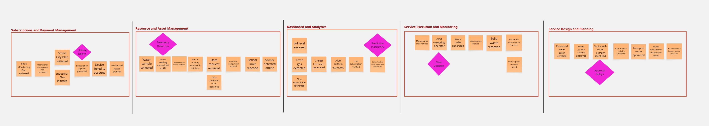

### 2.4. Big Picture Event Storming
En esta sección se procedera a mostrar el mapeo del recorrido de la aplicación  mediante un Big Picture Event Storming, en el cual se ha trabajado en equipo para comprender de mejor manera nuestro modelo de negocio. Tambien se mantiene la plantilla de la aplicación Miro para una mejor visualizaciñon de los pasos realizados: https://shorturl.at/Z9yMZ

#### Fase Previa: Definición de alcance y participantes
Antes de iniciar con la sesión programada, el equipo definió el alcance principal del análisis: mapear el ciclo completo de nuestro sistema Aquanetix, desde la suscripción hasta la entrega de agua.  

#### Paso 1: Recoleccion de Domain Events

   

En este primer paso, el equipo procedio a lanzar una lluvia de ideas y luego identificar todos los Domain Events posibles que formaran parte de nuestro mapeo de la aplicación, los cuales son representados mediante post-it's anaranjados y en tiempo pasado.

#### Paso 2: Secuenciación e Identificación de Pain Points

   

Una vez que los eventos hayan sido recolectados, se procedio a ordernarlos de forma cronológica para formar una línea de tiempo natural y lógica del flujo de negocio.

#### Paso 3: Definición de Bounded Contexts y Trazado de Fronteras

   

Finalmente, a partir de la línea de tiempo establecida, se trazan fronteras con el fin de agrupar y definir los bounded contexts iniciales con sus respectivos nombres, luego se colocaron indicadores fucsias para identificar cuellos de botella o ineficiencias técnicas y logísticas en el proceso actual. A continuacion se describirá a mayor detalle dichos cuellos de botella:

- **Linking Delays:** Este pain point refiere a la demora o fallo técnico cuando el usuario intenta vincular su sensor físico con la cuenta recién pagada.
- **Telemetry Data Loss:** En este pain point se identificó que los datos del sensor no lleguen a la base de datos por problemas de conexión o latencia.
- **Prediction Inaccuracy:** En dicho pain point, el riesgo detectado es la falla del algoritmo al identificar una anomalía donde no la hay, o una falla en la predicción de un pico de contaminación, generando alertas innecesarias.
- **Slow Dispatch:** En este pain point, el problema abundaria en el tiempo de respuesta al momento de calcular la duracion que pasa desde que el sistema detecta el problema hasta que la cuadrilla de mantenimiento realmente llega al lugar.
- **Approval Delays:** EL cuello de botella identificado trata sobre la lentitud burocrática o técnica para certificar que el agua tratada ya es apta para redistribuirse por los sectores solicitados.

