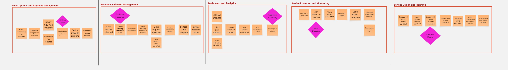

### 2.4. Big Picture Event Storming
En esta sección se procedera a mostrar el mapeo del recorrido de la aplicación  mediante un Big Picture Event Storming, en el cual se ha trabajado en equipo para comprender de mejor manera nuestro modelo de negocio. Tambien se mantiene la plantilla de la aplicación Miro para una mejor visualizaciñon de los pasos realizados: https://shorturl.at/Z9yMZ

#### Fase Previa: Definición de alcance y participantes
Antes de iniciar con la sesión programada, el equipo definió    

#### Paso 1: Recoleccion de Domain Events

   

En este primer paso, el equipo procedio a lanzar una lluvia de ideas y luego identificar todos los Domain Events posibles que formaran parte de nuestro mapeo de la aplicación, los cuales son representados mediante post-it's anaranjados y en tiempo pasado.

#### Paso 2: Secuenciación e Identificación de Pain Points

   

Una vez que los eventos hayan sido recolectados, se procedio a ordernarlos de forma cronológica para formar una línea de tiempo natural y lógica del flujo de negocio. Tambien se agrupo los domain events en sus respectivos 
bounded context iniciales para una mejor organización de eventos.
#### Paso 3: Definición de Bounded Contexts y Trazado de Fronteras

   

