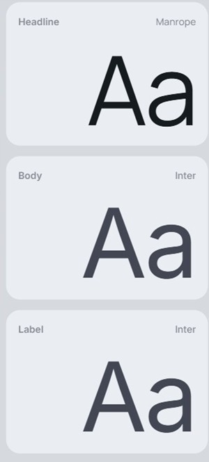
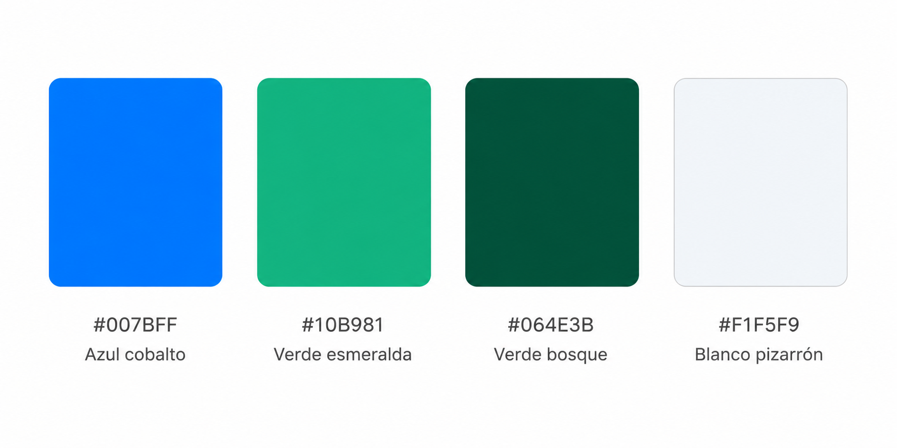
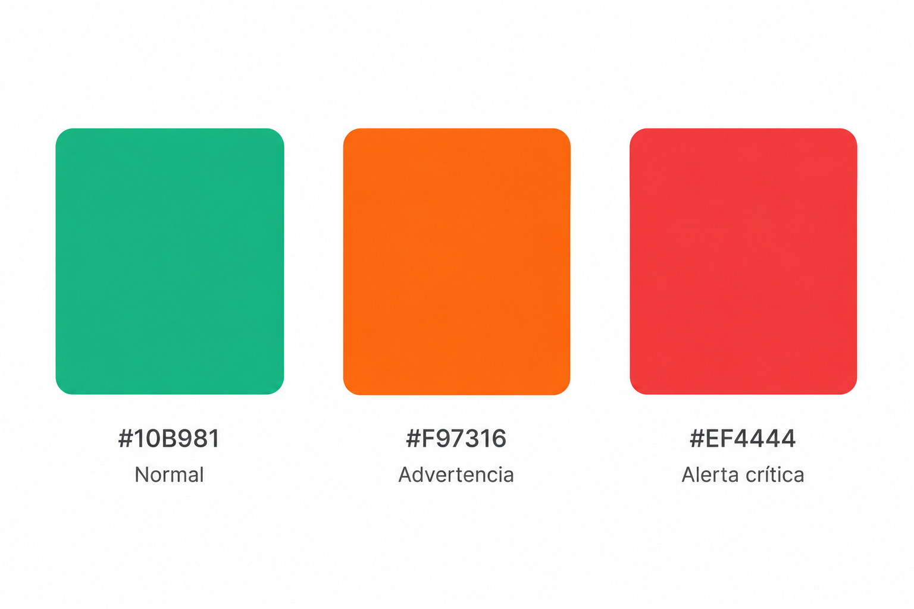

# Capítulo IV: Product Design

## 4.1. Style Guidelines:
Se considera un **Style Guideline** al conjunto de reglas y estándares que definen el cómo se debe redactar, diseñar y/o presentar diversas interfaces web, documentos, software u otros productos creativos, con el fin de asegurar una coherencia visual de un proyecto. A continuación se procederá a describir de forma más detallada los parámetros implementados en nuestra propuesta. 
### 4.1.1. General Style Guidelines
#### Branding
La identidad de Aquanetix se basa en el principio de "Ingeniería Hídrica Circular". Buscamos proyectar una imagen de tecnología de vanguardia aplicada directamente a la regeneración de un recurso natural. El logo es la materialización de este concepto: la fusión de la gota (naturaleza) y el nodo (tecnología/IoT).

Principios de Diseño:

> * Tecno-Naturaleza: Los componentes visuales deben equilibrar lo orgánico (formas fluidas del agua) con lo geométrico (precisión de los datos).
> * Claridad Operativa: La interfaz debe priorizar la legibilidad de métricas críticas sobre la ornamentación.
> * Transparencia: Reflejar la honestidad académica de la UPC en la presentación de datos.

#### Tipografía
La tipografía debe reflejar la solidez de una solución corporativa/municipal.
> * Encabezados (Manrope): Se utilizará en pesos Bold (700) y SemiBold (600). Su estructura geométrica y moderna da una imagen de startup sólida.
> * Cuerpo de Texto y Labels (Inter): Se utilizará para toda la lectura de datos, tablas y etiquetas. Es la fuente estándar en interfaces de alta densidad por su claridad en tamaños pequeños.
 

#### Colores
La paleta utilizada para el sitio web le da un mayor protagonismo a los azules vibrantes:
> * Azul cobalto (#007BFF): El color que representa la identidad de la app, usado para botones principales, navegación y estados de "Agua Limpia".
> * Verde esmeralda (#10B981): Acentos de éxito, sostenibilidad, recuperación y estados "Activo/Óptimo".
> * Verde bosque (#064E3B): Fondos de secciones oscuras, iconos de naturaleza y estados de "Eco-impacto".
> * Blanco pizarrón (#F1F5F9): Fondos de la aplicación (UI), tarjetas de datos y separación de secciones.

#### Principios de espaciado
Utilizaremos un sistema de espaciado basado en una rejilla de 8px (base 8). Esto garantiza que todos los componentes (gráficos de sensores, menús, tarjetas) tengan una relación matemática limpia. El espacio negativo debe ser amplio para reducir la "carga cognitiva" en dashboards complejos.

#### Tono de comunicación
Los tonos de comunicación serán mayormente serios, con un toque de entusiasmo. Queremos priorizar la precisión técnica y la confianza municipal, a la vez que queremos transmitir que el cambio es posible mediante la tecnología.

### 4.1.2. Web Style Guidelines

En esta sección se definen los estándares visuales y de interacción para la interfaz web de Aquanetix, asegurando una experiencia de usuario coherente, profesional y accesible en todos los dispositivos. La interfaz web prioriza la legibilidad de grandes volúmenes de datos operativos mediante una estructura modular y limpia, orientada a supervisores y operadores técnicos que requieren acceso rápido a métricas críticas del sistema hídrico.

**Grid y Layout**

La interfaz web de Aquanetix adopta un sistema de cuadrícula de 12 columnas con espaciado base de 8px, lo que permite organizar los paneles de monitoreo, tablas de sensores y tarjetas de indicadores de forma estructurada y adaptable. Los contenedores principales utilizan bordes sutilmente redondeados y sombras difuminadas para establecer jerarquía visual sin sobrecargar la interfaz. El diseño es completamente responsive, garantizando una experiencia fluida tanto en pantallas de escritorio para gerentes que analizan reportes, como en dispositivos móviles para operarios que registran datos en campo.

**Tipografía**

Siguiendo lo establecido en las General Style Guidelines, la tipografía web de Aquanetix utiliza Manrope en pesos Bold (700) y SemiBold (600) para encabezados de sección y títulos de paneles, mientras que Inter se emplea para etiquetas de datos, valores de sensores, descripciones de alertas y contenido de tablas. El tamaño de fuente se ajusta automáticamente según el dispositivo para garantizar legibilidad óptima en dashboards de alta densidad de información.

**Colores**

La paleta de colores definida en las General Style Guidelines se aplica en la interfaz web de la siguiente manera:

- **Azul cobalto (#007BFF):** Se utiliza en el icono de **Active devices** y constituye el color predominante del logotipo de **Aquanetix**, aportando identidad visual a la aplicación. También se emplea en elementos gráficos específicos para resaltar información.

- **Verde esmeralda (#10B981):** Se utiliza como color principal de la interfaz, presente en la **barra de navegación superior**, el indicador de **System efficiency**, el porcentaje de crecimiento, los estados **"Normal"**, el enlace **"View full map"** y otros elementos que representan el correcto funcionamiento del sistema.

- **Verde bosque (#064E3B):** Se reserva como color complementario de la identidad visual y para posibles elementos secundarios de la interfaz. En la pantalla mostrada su uso no es significativo.

- **Blanco pizarrón (#F1F5F9):** Se utiliza como fondo principal de la aplicación, proporcionando contraste con las tarjetas KPI, la tabla de monitoreo en tiempo real y los paneles de información para mejorar la legibilidad y la organización del contenido.

Adicionalmente, se incorporan colores semánticos para la representación de estados operativos de los sensores del sistema hídrico:

- **Verde esmeralda (#10B981):** Estado Normal — el sensor opera dentro de los parámetros establecidos.
- **Naranja (#F97316):** Estado Advertencia — el sensor se aproxima a un límite crítico y requiere monitoreo.
- **Rojo (#EF4444):** Estado Alerta crítica — el sensor ha superado el umbral permitido y requiere atención inmediata.

