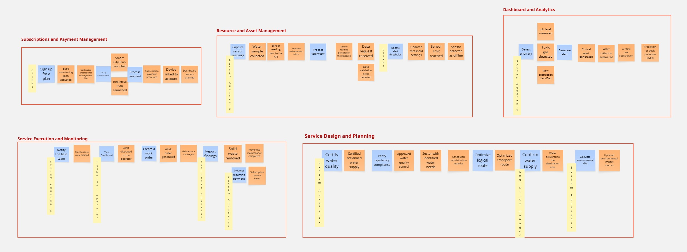
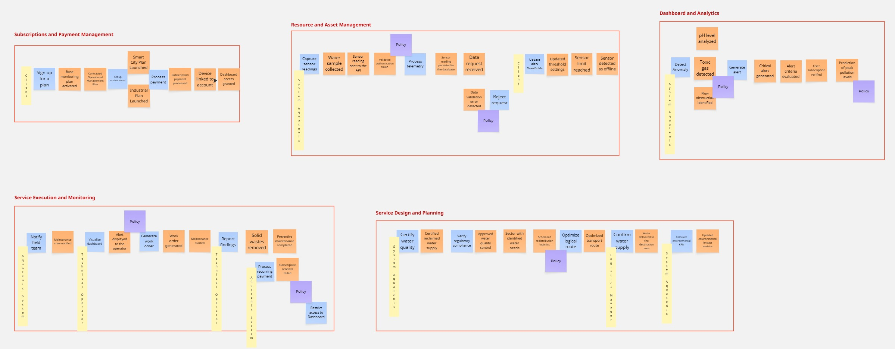
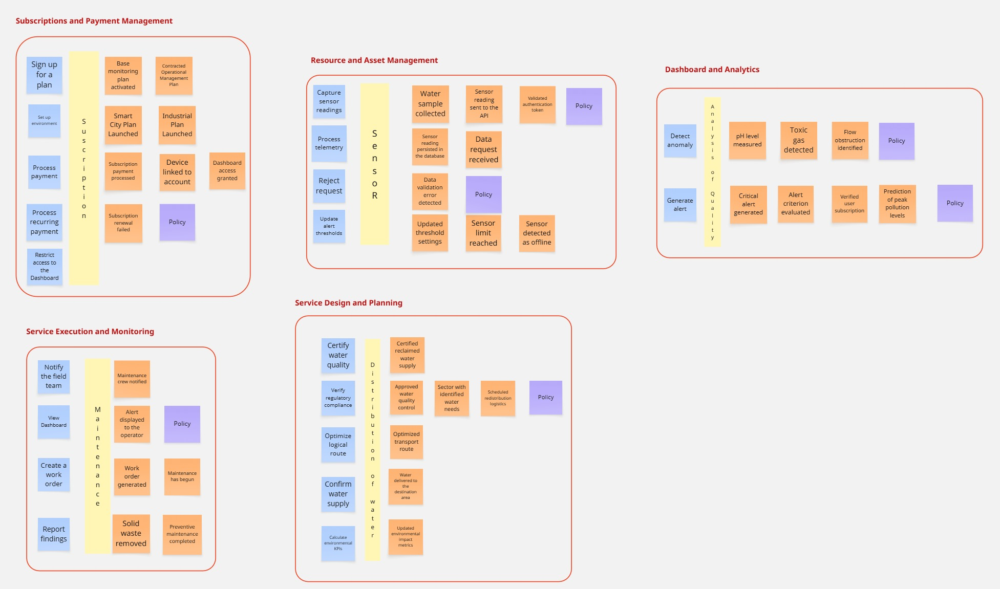
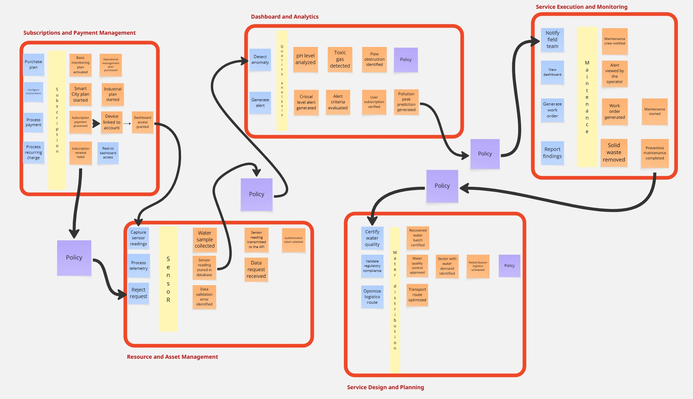
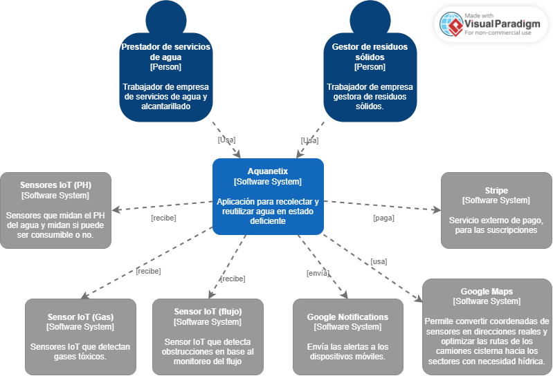
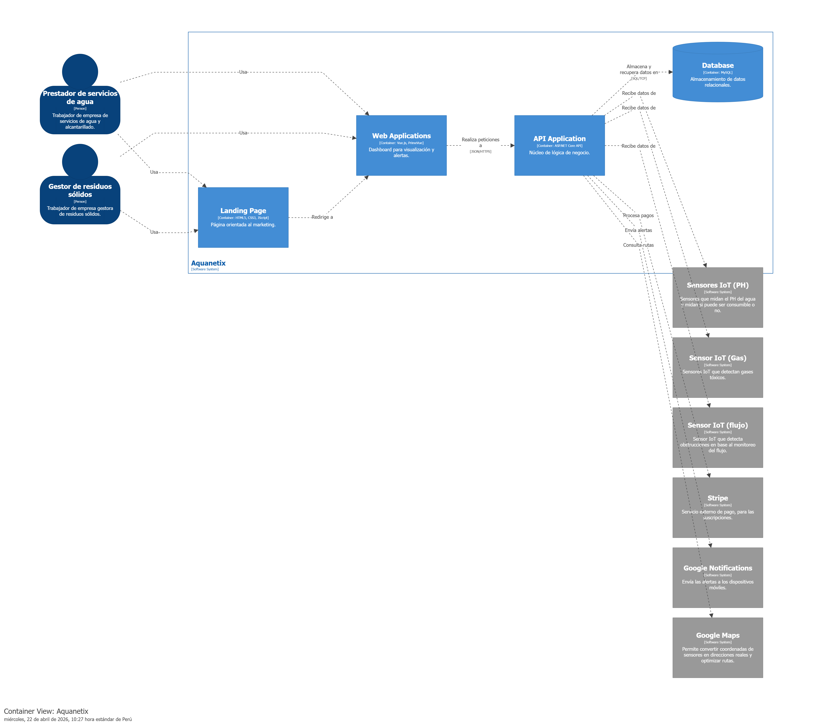
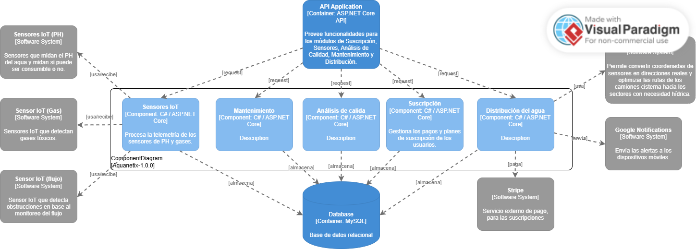

### 4.6. Domain-Driven Software Architecture
En esta seccion, se ha tomado el tiempo de 2 horas para identificar los diversos puntos de integración con servicios externos y definir la estructura necesaria por cada Bounded Context, con la seguridad de implementar una arquitectura SaaS escalable.
### 4.6.1. Design-Level EventStorming

A continuacion, se mostrará el Design-Level Event Storming de nuestra aplicación. En esta sección se profundizó a mayor detalle nuestro Big Picture Event Storming, enfocandonos en la arquitectura interna, componentes y resultados finales. Se menciona que se utilizó la herramiento Miro para la elaboracion de dicho mapeo, asi que se muestra a continuación el enlace para una mejor visualización: https://shorturl.at/ozZeU

**Paso 1: Definition of Commands and Actors**

Iniciamos el análisis identificando las acciones específicas (Comandos) que disparan los procesos en cada sub-dominio y  a los actores (usuarios o sistemas) responsables de ejecutar dichas acciones.

**Paso 2: Policy Design and Inter-Context Orchestration**

En este paso, establecimos con paciencia las Policies para gestionar el comportamiento reactivo y la comunicación entre los Bounded Contexts.

**Paso 3: Aggregate Modeling and Business Logic Rules**

Ya con el flujo de comunicación claro y definido, decidimos introducir los Agregados para definir las fronteras de consistencia, agrupando los comandos y eventos bajo entidades lógicas.

**Paso 4: Identification of External Systems, Read Models and Attribute Refinement**

En la etapa final, integramos los sistemas externos que el actor necesita visualizar antes de ejecutar un comando, asegurando una interfaz informada, incorporamos los Read Models para definir la información que el actor requiere visualizar antes de ejecutar un comando y desglosamos los Atributos técnicos (IDs, estados, parámetros técnicos) dentro de cada aggregate para eliminar ambigüedades para la codificación, definiendo exactamente qué información debe persistir en la base de datos para cada entidad del dominio.

### 4.6.2. Software Architecture Context Diagram

Este diagrama representa el nivel más alto de abstracción, mostrando el sistema como un solo elemento y detallando sus interacciones con el mundo exterior.

> * Centro del Sistema: Aquanetix se posiciona como el núcleo que recolecta y procesa datos para la reutilización de agua en estado deficiente.
> * Usuarios (Actors): Se identifican al Prestador de servicios de agua y al Gestor de residuos sólidos, quienes interactúan con la plataforma para sus respectivas labores operativas.
> * Sistemas Externos: El ecosistema se integra con Sensores IoT (PH, Gas y Flujo) para la captura de datos, Stripe para la gestión de pagos, Google Maps para la logística de rutas y Google Notifications para el envío de alertas móviles.

### 4.6.3. Software Architecture Container Diagrams

El diagrama de contenedores desglosa el sistema en sus unidades de ejecución principales, especificando las decisiones tecnológicas adoptadas.

> * Web Application: Desarrollada en Vue.js, es la interfaz responsiva donde los usuarios visualizan el dashboard y alertas.
> * Landing Page: Un sitio estático construido con HTML, CSS y JS destinado al marketing y captación de clientes.
> * API Application: Es el contenedor central desarrollado en ASP.NET Core API con C#. Este monolito modular expone los servicios que consumen las aplicaciones web y procesa la información de los sensores.
> * Database: Un contenedor de MySQL que actúa como motor de base de datos relacional para la persistencia de toda la información del sistema.

### 4.6.4. Software Architecture Components Diagrams

Este diagrama profundiza en el contenedor API Application, revelando cómo se organiza internamente la lógica de negocio basada en los Bounded Contexts identificados en el proceso de diseño.

> * Sensores IoT: Componente encargado de procesar la telemetría técnica recibida del hardware.
> * Análisis de Calidad: Componente que determina la potabilidad o toxicidad del agua recolectada.
> * Suscripción: Componente que gestiona los planes comerciales, pagos y el ciclo de vida de los usuarios de la plataforma.
> * Mantenimiento y Distribución: Componentes que coordinan las operaciones de campo y la logística de entrega de agua recuperada a los sectores con necesidad hídrica.
> * Distribución del agua: Componente que coordina la logística de entrega del recurso hídrico certificado y el cálculo de indicadores de impacto.
