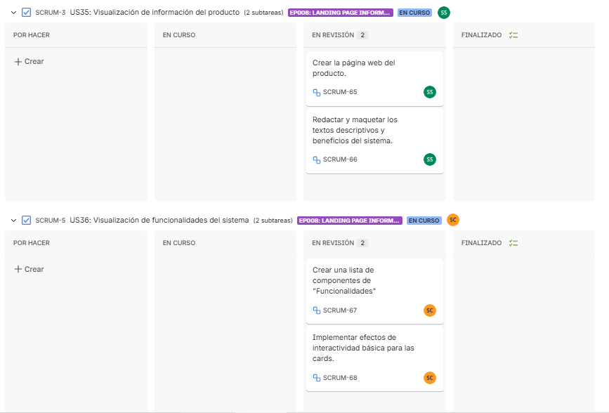
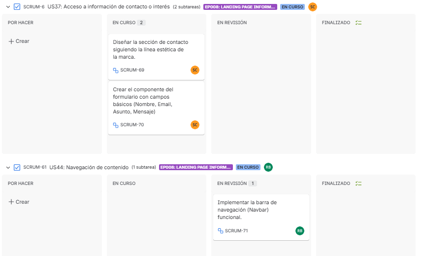
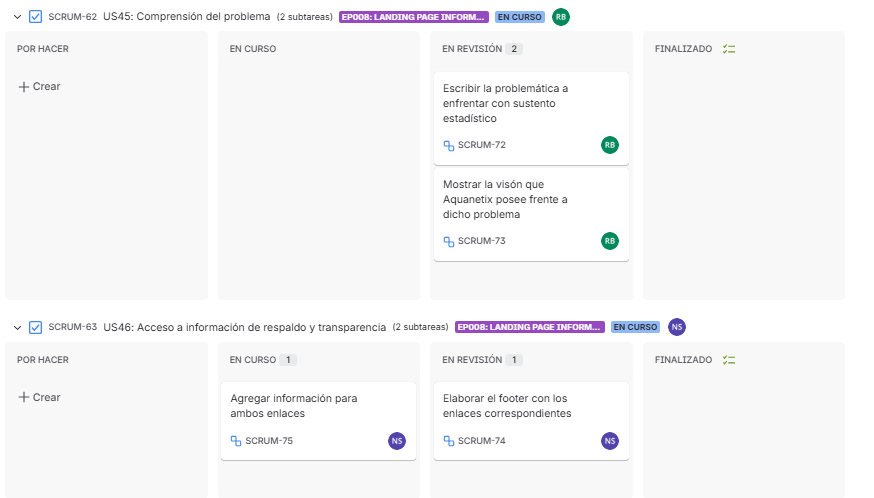
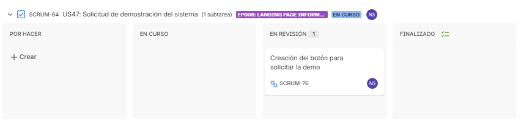
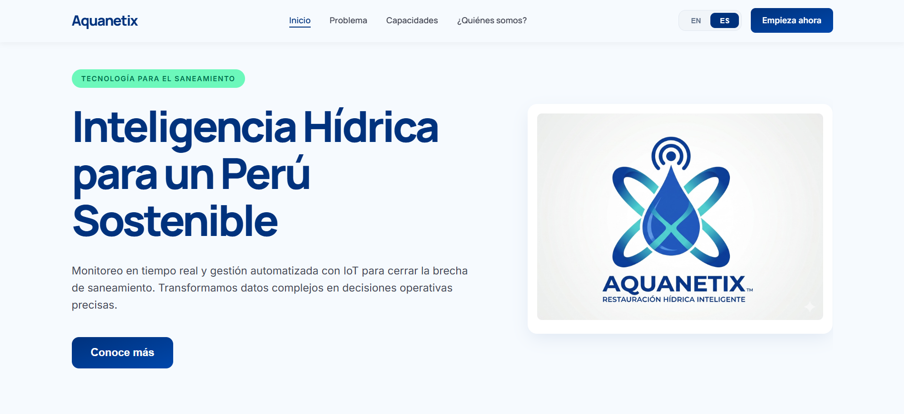
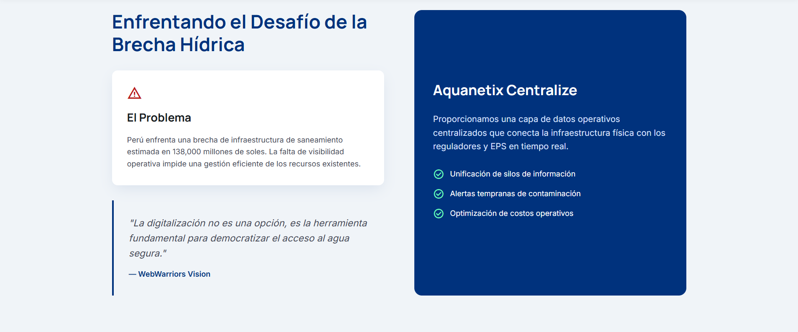
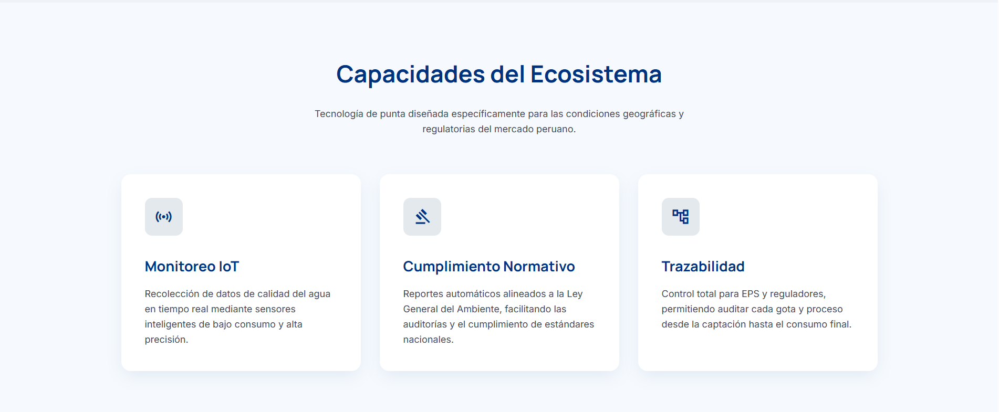
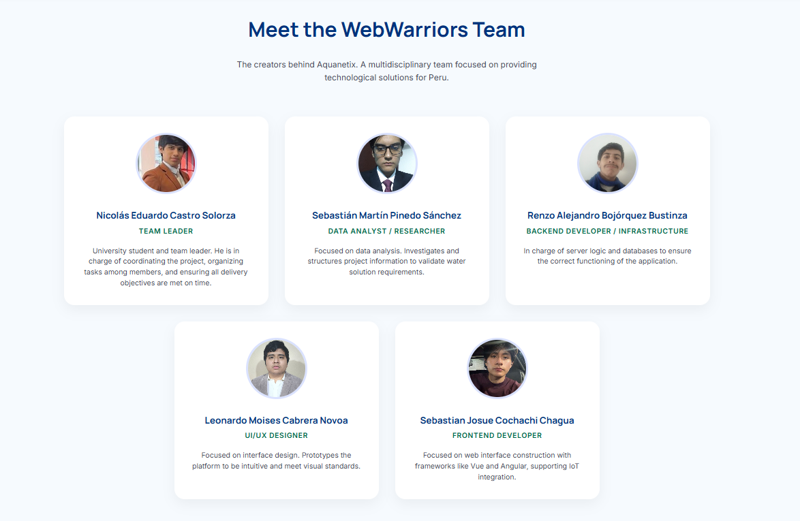

## 5.2. Landing Page, Services & Applications Implementation.
El desarrollo de la pagina principal, acoplamiento de servicios e implementación de las aplicaciones se consideran como pasos de alta importancia en lo que refiere a la elaboración del proyecto. Con el apoyo de estas etapas, permite al equipo tranformar conceptos simples en productos preparados para su uso. Esta fase nos ayuda a traducir los requisitos y especificaciones obtenidas a código con la finalidad de cumplir con las necesidades de nuestros segmentos objetivos.

### 5.2.1. Sprint 1
El primer sprint de nuestro proyecto posee una gran importancia en lo que refiere al proceso de desarrollo ágil. A lo largo de este periodo, se ha dado un enfoque con mayor énfasis en la implementación de las caracetericas fundamentales así como en las funcionalidades de mayor prioridad en nuestra planificación de inicio.

#### 5.2.1.1. Sprint Planning 1.

Para este sprint, la reunión de Sprint Planning nos permite evaluar nuestra velocidad previa y definir las nuevas metas técnicas del proyecto. En esta fase, el equipo selecciona las historias de usuario prioritarias del backlog, estima el esfuerzo necesario y asigna las tareas. El objetivo principal es mantener la alineación del equipo y garantizar que las nuevas funcionalidades operativas se integren de manera fluida, estableciendo un plan de trabajo claro.

| Campo / Sección | Detalle |
| :--- | :--- |
| Sprint # | Sprint 1 |
| Date | 2026-04-22 |
| Time | 9:00 PM |
| Location | Google meet |
| Prepared By | Castro Solorza, Nicolas Eduardo |
| Attendees (to planning meeting) | Pinedo Sánchez, Sebastián Martín / Castro Solorza, Nicolás Eduardo / Cochachi Chagua, Sebastián Josué / Cabrera Novoa, Leonardo Moisés / Bojórquez Bustinza, Renzo Alejandro |
| Sprint 1  Review Summary | Al ser el primer sprint del proyecto, no existe una revisión de un sprint anterior. El equipo partió de la aprobación del Product Backlog inicial, enfocándose en las Historias de Usuario prioritarias relacionadas al registro de empresas (Enterprise), configuración de planes y seguridad. |
| Sprint 1  Retrospective Summary | De igual manera al ser el inicio del proyecto, se establecieron las normas de trabajo del equipo: reuniones de seguimiento (Daily Stand-ups) mediante Meet, uso de herramientas ágiles para el control de tareas, sumado a la necesidad de mantener una comunicación constante para evitar bloqueos técnicos en el desarrollo del backend. |
| Sprint 1 Goal |Nuestro enfoque se centra en ofrecer el proceso inicial de registro y el acceso seguro a la plataforma para los clientes corporativos.
||Creemos que esto entrega autonomía a los administradores de las EPS para registrar sus organizaciones, seleccionar un plan de suscripción y gestionar de forma segura el acceso de sus ingenieros operativos.
||Esto será confirmado cuando un administrador de la empresa pueda registrar exitosamente su organización, elegir el plan 'Piloto' o 'Integral', e iniciar sesión en el panel de control de Aquanetix de forma segura sin intervención del equipo de soporte técnico.|
| Sprint 1 Velocity | El equipo ha establecido un Velocity de 26 Story Points, que representa la capacidad máxima de esfuerzo que los developers pueden aceptar de manera realista para este Sprint 1. |
| Sum of Story Points | 24 |

#### 5.2.1.2 Aspect Leaders and Collaborators

En esta sección se presenta la matriz de liderazgo y colaboración (LACX), donde se definen los roles de cada integrante del equipo en los distintos aspectos considerados dentro del Sprint.

Los aspectos seleccionados corresponden a las principales áreas del proyecto Aquanetix, incluyendo diseño UX/UI, desarrollo de la landing page, documentación y modelado del sistema.

| Team Member (Last Name, First Name) | GitHub Username | UX/UI Design | Landing Page | Documentation | Modeling |
|------------------------------------|----------------|-------------|-------------|--------------|----------|
| Bojórquez Bustinza, Renzo Alejandro | DeterminedSoul7 | C | C | C | L |
| Cabrera Novoa, Leonardo Moisés | u202415820 | C | C | C | C |
| Castro Solorza, Nicolás Eduardo | NicoCSE | C | L | L | C |
| Cochachi Chagua, Sebastian Josue | sebastiancochachi02-cmd | L | C | C | C |
| Pinedo Sanchez, Sebastián Martín | smp1107 | L | C | C | C |

#### 5.2.1.3 Sprint Backlog 1

El objetivo del presente Sprint fue el diseño y desarrollo de la landing page del sistema Aquanetix, enfocándose en la comunicación efectiva de la propuesta de valor, la presentación de funcionalidades clave y la facilitación del contacto con potenciales usuarios.

Durante este Sprint, el equipo trabajó de manera colaborativa en la construcción de las diferentes secciones de la landing page, asegurando una experiencia de usuario clara, intuitiva y alineada con los objetivos del sistema.

  
  
  
  

Enlace a la herramienta utilizada: https://shorturl.at/xs1Pv

A continuación, se detallan las User Stories priorizadas y las tareas asociadas:

| US Id | Title | Task Id | Task Title | Description | Estimation (Hours) | Assigned To | Status |
|------|------|--------|------------|------------|-------------------|-------------|--------|
| US-35 | Product value visualization | T-01 | Landing page structure | Diseño e implementación de la estructura general y sección principal (hero) de la landing page | 6 | Sebastián Pinedo | Done |
| US-36 | System features visualization | T-02 | Features section development | Diseño y desarrollo de la sección de funcionalidades destacando las capacidades del sistema | 5 | Sebastián Cochachi | Done |
| US-37 | Contact information access | T-03 | Contact and CTA section | Implementación de sección de contacto y botones de llamada a la acción | 4 | Nicolás Castro | Done |
| US-35 | Product value visualization | T-04 | Content definition and UX writing | Definición del contenido textual y estructura comunicativa de la landing | 4 | Leonardo Cabrera | Done |
| US-36 | System features visualization | T-05 | Visual design elements | Diseño de elementos visuales y apoyo gráfico para mejorar la experiencia de usuario | 4 | Renzo Bojórquez | In-Process |

#### 5.2.1.4 Development Evidence for Sprint Review

| Repository | Branch | Commit Ids | Commit Message | Commit Message Body | Committed on (Date) |
|------------|--------|-----------|----------------|---------------------|---------------------|
| aquanetix-repo | develop | 4f01889ae5953aba422050a86048518fc2e68577 | docs: add epics for requirements |  | 18/04/2026 |
| aquanetix-repo | develop | 80782311c16b14e26ad36489823096a0602afeb2 | docs: add landing page UI design |  | 20/04/2026 |
| aquanetix-repo | develop | 056333d1b065eda419cb3e109ebf525a4c3749cc | docs: add C4 model diagrams |  | 21/04/2026 |
| aquanetix-repo | develop | 73157436b4d739e7e78aa21fb0a791de3101dc81 | fix: update repository links |  | 21/04/2026 |
| aquanetix-repo | develop | 68a41d56032b2c50eb7a681cc9581219c6923cd7 | docs: add web app mockups |  | 22/04/2026 |

#### 5.2.1.5 Execution Evidence for Sprint Review

En esta sección se presentan evidencias de la ejecución de la landing page desarrollada durante el Sprint.

Las siguientes capturas muestran la interacción del usuario con las diferentes secciones de la landing page, permitiendo validar la estructura de información, la propuesta de valor y la navegación definida para el sistema Aquanetix.

**Figura 1. Sección principal de la landing page**

  

La figura muestra la sección principal de la landing page, donde se presenta la propuesta de valor del sistema Aquanetix junto con un llamado a la acción dirigido al usuario.

**Figura 2. Sección informativa de la landing page**

  

En esta sección se describe el problema abordado y la solución propuesta por el sistema, permitiendo al usuario comprender el propósito y beneficios del servicio.

**Figura 3. Sección de funcionalidades**

  

La figura muestra las principales funcionalidades del sistema, destacando las capacidades de monitoreo, gestión de alertas y análisis de datos.

**Figura 4. Sección final y llamado a la acción**

  

En esta sección final se incluye un llamado a la acción que invita al usuario a interactuar con el sistema, junto con información adicional relevante.

#### 5.2.1.6 Services Documentation Evidence for Sprint Review

En el alcance del presente Sprint, no se han implementado servicios web ni endpoints documentados con OpenAPI, debido a que el desarrollo del proyecto se ha centrado principalmente en la construcción de la landing page estática y en el diseño del prototipo de la aplicación.
Por lo tanto, en esta fase no se cuenta con documentación de Web Services, ya que estos serán considerados en Sprints posteriores, donde se abordará la implementación técnica del sistema y la integración de servicios backend.

#### 5.2.1.7. Software Deployment Evidence for Sprint Review.

Esta seccion se ha decidido omitir debido que, para este avance, solamente se ha enfocado en el diseño de Landing Page. En futuros entregables se procedera a brindar una informacion mas detallada de la aplicacion.

#### 5.2.1.8. Team Collaboration Insights during Sprint

Para el desarrollo de este primer sprint, todos los miembros del equipo desarrollaron y colaboraron de manera activa ycontinua. De tal modo, se muestra como evidencia los insights de cada miembro del equipo.

   

### 5.2.2. Sprint 2
El segundo sprint de nuestro proyecto estuvo enfocado en el desarrollo de funcionalidades relacionadas al monitoreo inteligente de la red hídrica, la gestión de alertas automáticas y la administración de parámetros operativos dentro del sistema. Durante este periodo, el equipo priorizó la implementación de módulos backend orientados al procesamiento de datos de sensores, validación de condiciones críticas y generación de información operativa para supervisores y operadores técnicos.

#### 5.2.2.1. Sprint Planning 2.

En esta sección se especifican los aspectos principales del Sprint Planning Meeting. El segundo sprint de nuestro proyecto posee una gran importancia en lo que refiere al proceso de desarrollo ágil y la construcción de la lógica de negocio en el backend. A lo largo de este periodo, se ha dado un enfoque con mayor énfasis en la implementación de las características fundamentales de monitoreo químico y la gestión de acceso, así como en las funcionalidades de mayor prioridad en nuestra planificación de inicio, asegurando que el equipo entregue valor tangible a los usuarios de la plataforma.

| Campo / Sección | Detalle |
| :--- | :--- |
| Sprint # | Sprint 2 |
| Date | 2026-05-10 |
| Time | 9:00 PM |
| Location | Google meet |
| Prepared By | Castro Solorza, Nicolas Eduardo |
| Attendees (to planning meeting) | Pinedo Sánchez, Sebastián Martín / Castro Solorza, Nicolás Eduardo / Cochachi Chagua, Sebastián Josué / Cabrera Novoa, Leonardo Moisés |
| Sprint 2  Review Summary | Durante el Sprint 2 se lograron desplegar los cimientos de la arquitectura backend y los endpoints iniciales de registro de cuentas. El Product Owner validó positivamente la estructura inicial, pero resaltó que para entregar verdadero valor al negocio es prioritario enfocarse ahora en el flujo de suscripciones que habilita los tableros, y en el motor de reglas de los sensores químicos para la detección temprana de anomalías. |
| Sprint 2  Retrospective Summary | El equipo identificó como un gran acierto la comunicación constante en los Daily Stand-ups. Sin embargo, como oportunidad de mejora, se evidenció la necesidad de aplicar de forma más estricta las buenas prácticas de programación (uso de DTOs, Inyección de Dependencias y manejo de excepciones) desde la planificación de las tareas, para evitar bloqueos técnicos y mantener un flujo de trabajo continuo. |
| Sprint 2 Goal |Nuestro enfoque está en implementar un control de acceso automatizado por suscripciones y configurar los rangos de seguridad para los sensores químicos (pH) en la API del backend.
||Creemos que esto entrega una experiencia de inicio ágil y capacidades de monitoreo proactivo para prevenir la corrosión de las tuberías a los operadores técnicos.
||Esto se confirmará cuando los operadores técnicos puedan adquirir con éxito una suscripción para desbloquear los endpoints protegidos del tablero, y el sistema evalúe correctamente las lecturas de los umbrales de pH, activando alertas de forma precisa sin fallos en el backend cuando los valores superen los límites permitidos. |
| Sprint 2 Velocity | Para este Sprint 2, evaluando el desempeño previo y la capacidad actual del equipo, se ha establecido un Velocity de 67 Story Points. |
| Sum of Story Points | 67 |
