## 5.2. Landing Page, Services & Applications Implementation.
El desarrollo de la pagina principal, acoplamiento de servicios e implementación de las aplicaciones se consideran como pasos de alta importancia en lo que refiere a la elaboración del proyecto. Con el apoyo de estas etapas, permite al equipo tranformar conceptos simples en productos preparados para su uso. Esta fase nos ayuda a traducir los requisitos y especificaciones obtenidas a código con la finalidad de cumplir con las necesidades de nuestros segmentos objetivos.

### 5.2.1. Sprint 1
El primer sprint de nuestro proyecto posee una gran importancia en lo que refiere al proceso de desarrollo ágil. A lo largo de este periodo, se ha dado un enfoque con mayor énfasis en la implementación de las caracetericas fundamentales así como en las funcionalidades de mayor prioridad en nuestra planificación de inicio.

#### 5.2.1.1. Sprint Planning 1.

Para este sprint, la reunión de Sprint Planning nos permite evaluar nuestra velocidad previa y definir las nuevas metas técnicas del proyecto. En esta fase, el equipo selecciona las historias de usuario prioritarias del backlog, estima el esfuerzo necesario y asigna las tareas. El objetivo principal es mantener la alineación del equipo y garantizar que las nuevas funcionalidades operativas se integren de manera fluida, estableciendo un plan de trabajo claro.

| Campo / Sección | Detalle |
| :--- | :--- |
| Sprint # | Sprint 1 |
| Date | 2026-04-22 |
| Time | 9:00 PM |
| Location | Google meet |
| Prepared By | Castro Solorza, Nicolas Eduardo |
| Attendees (to planning meeting) | Pinedo Sánchez, Sebastián Martín / Castro Solorza, Nicolás Eduardo / Cochachi Chagua, Sebastián Josué / Cabrera Novoa, Leonardo Moisés / Bojórquez Bustinza, Renzo Alejandro |
| Sprint 1  Review Summary | Al ser el primer sprint del proyecto, no existe una revisión de un sprint anterior. El equipo partió de la aprobación del Product Backlog inicial, enfocándose en las Historias de Usuario prioritarias relacionadas al registro de empresas (Enterprise), configuración de planes y seguridad. |
| Sprint 1  Retrospective Summary | De igual manera al ser el inicio del proyecto, se establecieron las normas de trabajo del equipo: reuniones de seguimiento (Daily Stand-ups) mediante Meet, uso de herramientas ágiles para el control de tareas, sumado a la necesidad de mantener una comunicación constante para evitar bloqueos técnicos en el desarrollo del backend. |
| Sprint 1 Goal |Nuestro enfoque se centra en comunicar nuestra propuesta de valor de la plataforma a los visitantes de la Landing Page.<br>Creemos que esto entregará una Landing Page llamativa, con datos reales, que interesen a los visitantes.<br>Esto será confirmado cuando los visitantes examinen la Landing Page y demuestren interés en suscribirse dando clic al botón de Acceso al Dashboard, aunque este no sea funcional aún.|
| Sprint 1 Velocity | El equipo ha establecido un Velocity de 26 Story Points, que representa la capacidad máxima de esfuerzo que los developers pueden aceptar de manera realista para este Sprint 1. |
| Sum of Story Points | 24 |

#### 5.2.1.2 Aspect Leaders and Collaborators

En esta sección se presenta la matriz de liderazgo y colaboración (LACX), donde se definen los roles de cada integrante del equipo en los distintos aspectos considerados dentro del Sprint.

Los aspectos seleccionados corresponden a las principales áreas del proyecto Aquanetix, incluyendo diseño UX/UI, desarrollo de la landing page, documentación y modelado del sistema.

| Team Member (Last Name, First Name) | GitHub Username | UX/UI Design | Landing Page | Documentation | Modeling |
|------------------------------------|----------------|-------------|-------------|--------------|----------|
| Bojórquez Bustinza, Renzo Alejandro | DeterminedSoul7 | C | C | C | L |
| Cabrera Novoa, Leonardo Moisés | u202415820 | C | C | C | C |
| Castro Solorza, Nicolás Eduardo | NicoCSE | C | L | L | C |
| Cochachi Chagua, Sebastian Josue | sebastiancochachi02-cmd | L | C | C | C |
| Pinedo Sanchez, Sebastián Martín | smp1107 | L | C | C | C |

#### 5.2.1.3 Sprint Backlog 1

El objetivo del presente Sprint fue el diseño y desarrollo de la landing page del sistema Aquanetix, enfocándose en la comunicación efectiva de la propuesta de valor, la presentación de funcionalidades clave y la facilitación del contacto con potenciales usuarios.

Durante este Sprint, el equipo trabajó de manera colaborativa en la construcción de las diferentes secciones de la landing page, asegurando una experiencia de usuario clara, intuitiva y alineada con los objetivos del sistema.

<div align="center">
  
  
  
  
</div>

Enlace a la herramienta utilizada: https://shorturl.at/xs1Pv

A continuación, se detallan las User Stories priorizadas y las tareas asociadas:

| US Id | Title | Task Id | Task Title | Description | Estimation (Hours) | Assigned To | Status |
|------|------|--------|------------|------------|-------------------|-------------|--------|
| US-35 | Product value visualization | T-01 | Landing page structure | Diseño e implementación de la estructura general y sección principal (hero) de la landing page | 6 | Sebastián Pinedo | Done |
| US-36 | System features visualization | T-02 | Features section development | Diseño y desarrollo de la sección de funcionalidades destacando las capacidades del sistema | 5 | Sebastián Cochachi | Done |
| US-37 | Contact information access | T-03 | Contact and CTA section | Implementación de sección de contacto y botones de llamada a la acción | 4 | Nicolás Castro | Done |
| US-35 | Product value visualization | T-04 | Content definition and UX writing | Definición del contenido textual y estructura comunicativa de la landing | 4 | Leonardo Cabrera | Done |
| US-36 | System features visualization | T-05 | Visual design elements | Diseño de elementos visuales y apoyo gráfico para mejorar la experiencia de usuario | 4 | Renzo Bojórquez | In-Process |

#### 5.2.1.4 Development Evidence for Sprint Review

| Repository | Branch | Commit Ids | Commit Message | Commit Message Body | Committed on (Date) |
|------------|--------|-----------|----------------|---------------------|---------------------|
| aquanetix-repo | develop | 4f01889ae5953aba422050a86048518fc2e68577 | docs: add epics for requirements |  | 18/04/2026 |
| aquanetix-repo | develop | 80782311c16b14e26ad36489823096a0602afeb2 | docs: add landing page UI design |  | 20/04/2026 |
| aquanetix-repo | develop | 056333d1b065eda419cb3e109ebf525a4c3749cc | docs: add C4 model diagrams |  | 21/04/2026 |
| aquanetix-repo | develop | 73157436b4d739e7e78aa21fb0a791de3101dc81 | fix: update repository links |  | 21/04/2026 |
| aquanetix-repo | develop | 68a41d56032b2c50eb7a681cc9581219c6923cd7 | docs: add web app mockups |  | 22/04/2026 |

#### 5.2.1.5 Execution Evidence for Sprint Review

En esta sección se presentan evidencias de la ejecución de la landing page desarrollada durante el Sprint.

Las siguientes capturas muestran la interacción del usuario con las diferentes secciones de la landing page, permitiendo validar la estructura de información, la propuesta de valor y la navegación definida para el sistema Aquanetix.

**Figura 1. Sección principal de la landing page**

<div align="center">
  
</div>
La figura muestra la sección principal de la landing page, donde se presenta la propuesta de valor del sistema Aquanetix junto con un llamado a la acción dirigido al usuario.


**Figura 2. Sección informativa de la landing page**

<div align="center">
  
</div>

En esta sección se describe el problema abordado y la solución propuesta por el sistema, permitiendo al usuario comprender el propósito y beneficios del servicio.

**Figura 3. Sección de funcionalidades**

<div align="center">
  
</div>

La figura muestra las principales funcionalidades del sistema, destacando las capacidades de monitoreo, gestión de alertas y análisis de datos.

**Figura 4. Sección final y llamado a la acción**

<div align="center">
  
</div>

En esta sección final se incluye un llamado a la acción que invita al usuario a interactuar con el sistema, junto con información adicional relevante.

#### 5.2.1.6 Services Documentation Evidence for Sprint Review

En el alcance del presente Sprint, no se han implementado servicios web ni endpoints documentados con OpenAPI, debido a que el desarrollo del proyecto se ha centrado principalmente en la construcción de la landing page estática y en el diseño del prototipo de la aplicación.
Por lo tanto, en esta fase no se cuenta con documentación de Web Services, ya que estos serán considerados en Sprints posteriores, donde se abordará la implementación técnica del sistema y la integración de servicios backend.

#### 5.2.1.7. Software Deployment Evidence for Sprint Review.

Esta seccion se ha decidido omitir debido que, para este avance, solamente se ha enfocado en el diseño de Landing Page. En futuros entregables se procedera a brindar una informacion mas detallada de la aplicacion.

#### 5.2.1.8. Team Collaboration Insights during Sprint

Para el desarrollo de este primer sprint, todos los miembros del equipo desarrollaron y colaboraron de manera activa y continua. De tal modo, se muestra como evidencia los insights de cada miembro del equipo.
<p align = "left">
   
</p>

### 5.2.2. Sprint 2
El segundo sprint de nuestro proyecto estuvo enfocado en el desarrollo de funcionalidades relacionadas al monitoreo inteligente de la red hídrica, la gestión de alertas automáticas y la administración de parámetros operativos dentro del sistema. Durante este periodo, el equipo priorizó la implementación de módulos backend orientados al procesamiento de datos de sensores, validación de condiciones críticas y generación de información operativa para supervisores y operadores técnicos.

#### 5.2.2.1. Sprint Planning 2.

En esta sección se especifican los aspectos principales del Sprint Planning Meeting. El segundo sprint de nuestro proyecto posee una gran importancia en lo que refiere al proceso de desarrollo ágil y la construcción de la lógica de negocio en el backend. A lo largo de este periodo, se ha dado un enfoque con mayor énfasis en la implementación de las características fundamentales de monitoreo químico y la gestión de acceso, así como en las funcionalidades de mayor prioridad en nuestra planificación de inicio, asegurando que el equipo entregue valor tangible a los usuarios de la plataforma.

| Campo / Sección | Detalle |
| :--- | :--- |
| Sprint # | Sprint 2 |
| Date | 2026-05-10 |
| Time | 9:00 PM |
| Location | Google meet |
| Prepared By | Castro Solorza, Nicolas Eduardo |
| Attendees (to planning meeting) | Pinedo Sánchez, Sebastián Martín / Castro Solorza, Nicolás Eduardo / Cochachi Chagua, Sebastián Josué / Cabrera Novoa, Leonardo Moisés / Bojórquez Bustinza, Renzo Alejandro |
| Sprint 2  Review Summary | Durante el Sprint 2 se lograron desplegar los cimientos de la arquitectura frontend y los endpoints iniciales pertenecientes a los bounded context identificados. El Product Owner validó positivamente la estructura inicial, pero resaltó que para entregar verdadero valor al negocio es prioritario enfocarse ahora en el flujo de suscripciones que habilita los tableros, y en el motor de reglas de los sensores químicos para la detección temprana de anomalías. |
| Sprint 2  Retrospective Summary | El equipo identificó como un gran acierto la comunicación constante en los Daily Stand-ups. Sin embargo, como oportunidad de mejora, se evidenció la necesidad de aplicar de forma más estricta las buenas prácticas de programación (uso de DTOs, Inyección de Dependencias y manejo de excepciones) desde la planificación de las tareas, para evitar bloqueos técnicos y mantener un flujo de trabajo continuo. |
| Sprint 2 Goal |Nuestro enfoque está en captar la atención de los visitantes de la página web de Aquanetix y darles a las empresas la posibilidad de monitorear sus dispositivos con seguridad.<br>Creemos que esto proporcionará una Landing Page atractiva para los visitantes y una aplicación de monitoreo y registro de dispositivos consistente para las empresas.<br>Esto se confirmará cuando los visitantes puedan acceder a la plataforma directamente desde la Landing Page y las empresas puedan registrar sus dispositivos y alertas y que estos estén conectados a una MockAPI.|
| Sprint 2 Velocity | Para este Sprint 2, evaluando el desempeño previo y la capacidad actual del equipo, se ha establecido un Velocity de 67 Story Points. |
| Sum of Story Points | 67 |

#### 5.2.2.2 Aspect Leaders and Collaborators

En esta sección se presenta la matriz de liderazgo y colaboración (LACX), donde se definen los roles de cada integrante del equipo en los distintos aspectos considerados dentro del Sprint.

Los aspectos seleccionados corresponden a las principales áreas del proyecto Aquanetix, incluyendo diseño UX/UI, desarrollo de la web application, documentación y modelado del sistema.

| Team Member (Last Name, First Name) | GitHub Username | UX/UI Design | Web Application | Documentation | Modeling |
|------------------------------------|----------------|-------------|-------------|--------------|----------|
| Bojórquez Bustinza, Renzo Alejandro | DeterminedSoul7 | C | C | C | L |
| Cabrera Novoa, Leonardo Moisés | u202415820 | C | L | C | C |
| Castro Solorza, Nicolás Eduardo | NicoCSE | C | C | L | C |
| Cochachi Chagua, Sebastian Josue | sebastiancochachi02-cmd | L | C | C | C |
| Pinedo Sanchez, Sebastián Martín | smp1107 | L | C | C | C |


#### 5.2.2.3. Sprint Backlog 2

El objetivo de este sprint backlog 2 fue el designar tareas referente al frontend de nuestra web application del sistema Aquanetix en lo que refiere a diseño y funcionalidad. Mayormente el enfoque fue la maquetación de los paneles de control y la integración de la interfaz con las lógicas de estado, garantizando que el sistema refleje adecuadamente los datos de calidad de agua y las métricas operativas del usuario.

Durante este Sprint, el equipo trabajó de manera colaborativa en la construcción de las diferentes secciones de la web application, asegurando una muestra del como funciona la aplicacion que se está proponiendo.

<div align="center">
  
  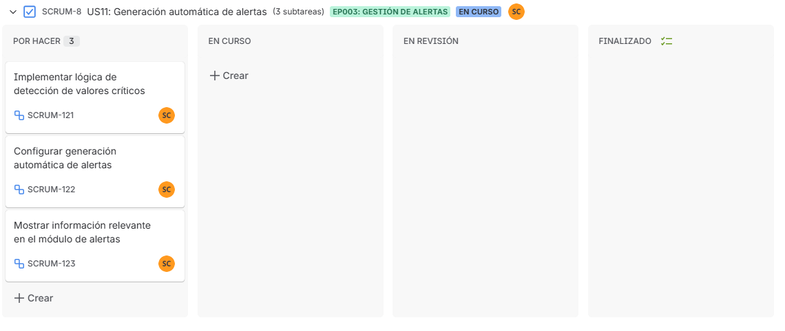
  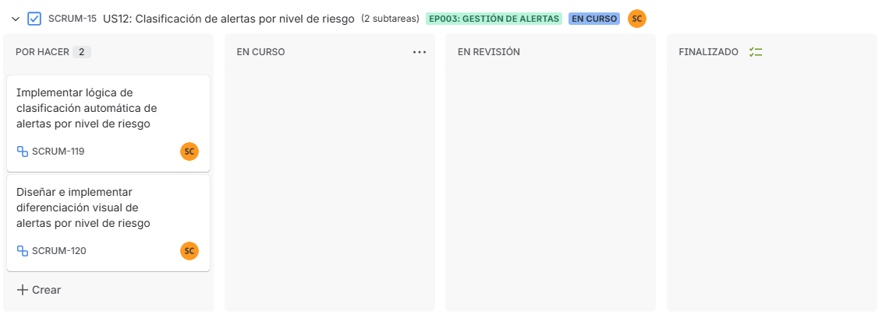
  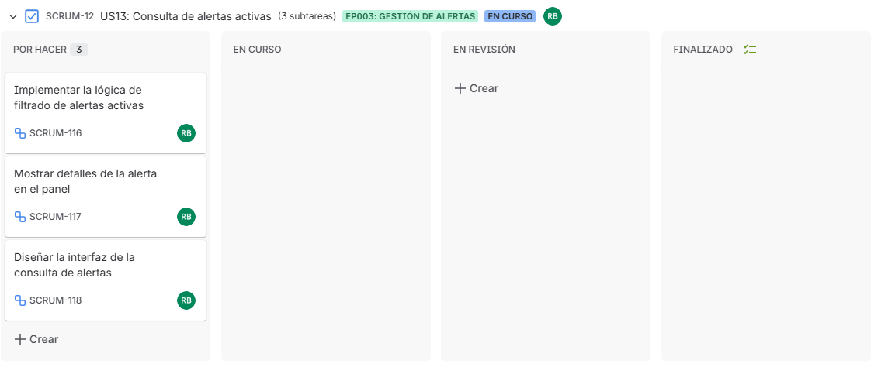
</div>

Enlace a la herramienta utilizada: https://shorturl.at/xs1Pv

A continuación, se detallan las User Stories priorizadas y las tareas asociadas:

| US Id | Title | Task Id | Task Title | Description | Estimation (Hours) | Assigned To | Status |
|------|------|--------|------------|------------|-------------------|-------------|--------|
| US-38 | Detectar alertas críticas en tiempo real | T-01 | Implementar lógica de detección de alertas | Implementar lógica de detección de alertas | 6 | Sebastián Pinedo | Done |
| US-5 | Actualizar automáticamente el estado de los sensores | T-02 | Implementar actualización automática de estados | Implementar actualización automática de estados | 5 | Sebastián Cochachi | Done |
| US-11 | Generar alertas automáticas por valores fuera de rango | T-03 | Configurar generación automática de alertas | Configurar generación automática de alertas | 4 | Nicolás Castro | Done |
| US-12 | Clasificar alertas según nivel de riesgo | T-04 | Implementar lógica de clasificación automática de alertas por nivel de riesgo | Implementar lógica de clasificación automática de alertas por nivel de riesgo | 4 | Leonardo Cabrera | Done |


#### 5.2.2.4. Development Evidence for Sprint Review

| Repository | Branch | Commit Ids | Commit Message | Commit Message Body | Committed on (Date) |
|------------|--------|-----------|----------------|---------------------|---------------------|
| WebApplication_Aquanetix | develop | 236860c843b3994a07d4343fea70ae5e2d23547c | feat: add environment configuration and mock data for sensors, alerts, and subscription |  | 11/05/2026 |
| WebApplication_Aquanetix | develop | b91719d0b7528d4590acb04b9cad82ace9ab4f44 | feat: add suscription view and global styles |  | 11/05/2026 |
| WebApplication_Aquanetix | develop | 42029d5820c7057a3c83a8f369ef244e052a8931 | feat: add monitoring api |  | 11/05/2026 |
| WebApplication_Aquanetix | develop | 14ad2b6af63d89a504668db6d7c9ee7ee666c404 | feat: set up global router with monitoring routes |  | 11/05/2026 |
| WebApplication_Aquanetix | develop | 711f56ed7ee0b2c4e00645e420774cdd44102c5b | feat: add shared layout and language switcher components |  | 11/05/2026 |

#### 5.2.2.5. Execution Evidence for Sprint Review

En esta sección se presentan evidencias de la ejecución de la web application desarrollada durante el Sprint.

Las siguientes capturas muestran la interacción del usuario con las diferentes secciones de la web application.

**Figura 1. Dashboard principal**

<div align="center">
  
</div>

La figura muestra el dashboard principal de la web application Aquanetix, donde el usuario puede visualizar en tiempo real el estado general del sistema, incluyendo dispositivos activos, alertas críticas, volumen tratado y eficiencia operativa. Además, se presentan tablas y paneles informativos que facilitan el monitoreo y supervisión de los sensores conectados.

**Figura 2. Listado de dispositivos**

<div align="center">
  
</div>

La figura muestra la sección de dispositivos de la aplicación web, donde se presenta una tabla con todos los sensores registrados en el sistema. El usuario puede visualizar información relevante como ubicación, tipo de sensor, valor actual y estado operativo, además de realizar acciones de consulta y edición sobre cada dispositivo.

**Figura 3. Registro de nuevo dispositivo**

<div align="center">
  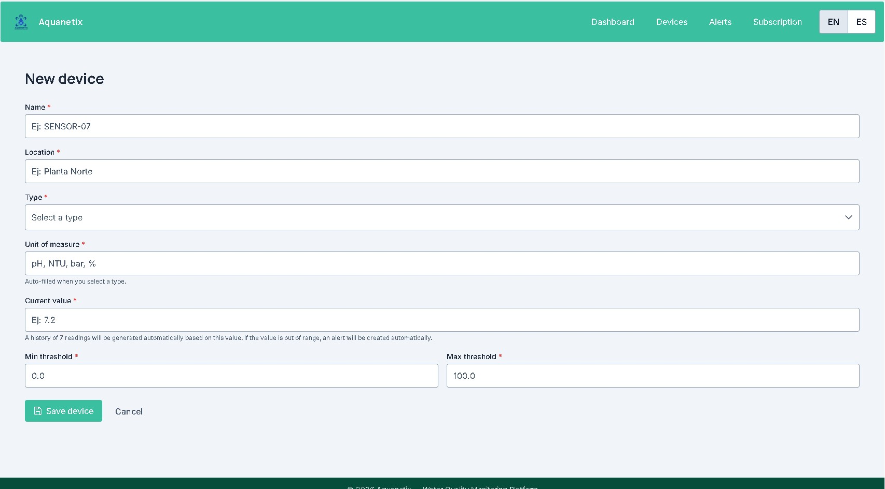
</div>

La figura representa el formulario de registro de nuevos dispositivos dentro de la plataforma Aquanetix. El usuario puede ingresar información relacionada al sensor, como nombre, ubicación, tipo, unidad de medida y umbrales permitidos, facilitando la incorporación de nuevos dispositivos al sistema de monitoreo.

**Figura 4. Gestión de alertas**

<div align="center">
  
</div>

La figura muestra el módulo de alertas de la aplicación web, en el cual el usuario puede visualizar y gestionar alertas activas generadas por los sensores del sistema. Cada alerta incluye información relacionada al dispositivo, nivel de prioridad y ubicación, permitiendo identificar rápidamente incidencias críticas dentro de la operación.

**Figura 5. Gestión de suscripción**

<div align="center">
  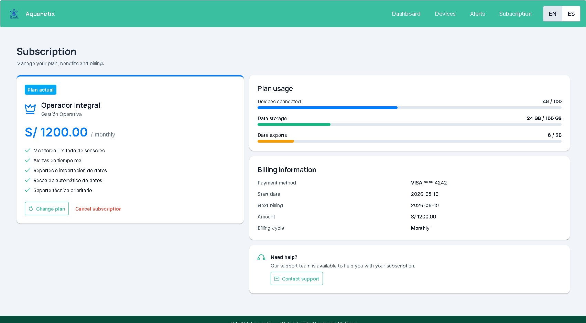
</div>

La figura presenta la sección de suscripción de la plataforma, donde el usuario puede consultar la información de su plan actual, visualizar el uso de recursos disponibles y acceder a datos de facturación. Asimismo, se incluyen opciones para cambiar o cancelar la suscripción según las necesidades del usuario.

#### 5.2.2.6. Services Documentation Evidence for Sprint Review

En el alcance del presente Sprint 2, el equipo no ha implementado un Web Service propio con documentación OpenAPI/Swagger, dado que el backend formal en ASP.NET Core corresponde a un entregable posterior (AV2/TB2). Sin embargo, la Frontend Web Application integra dos servicios REST externos que actúan como fuente de datos simulada durante esta fase de desarrollo:

**Servicio 1 — MockAPI (Sensores y Alertas)**
URL base: `https://6a01f74d0d92f63dd2531d8e.mockapi.io/api/v1`

| Endpoint | Verbo HTTP | Descripción | Parámetros | Response ejemplo |
|----------|-----------|-------------|------------|-----------------|
| `/sensors` | GET | Obtiene todos los dispositivos IoT registrados | — | Array de objetos Sensor (id, name, location, type, currentValue, unit, status, minAlert, maxAlert, history) |
| `/sensors/{id}` | GET | Obtiene un dispositivo por ID | `id`: string | Objeto Sensor |
| `/sensors` | POST | Registra un nuevo dispositivo IoT | Body: objeto Sensor sin id | Objeto Sensor creado con id asignado |
| `/sensors/{id}` | PUT | Actualiza datos de un dispositivo | `id`: string · Body: objeto Sensor | Objeto Sensor actualizado |
| `/sensors/{id}` | DELETE | Elimina un dispositivo | `id`: string | Objeto eliminado |
| `/alerts` | GET | Obtiene todas las alertas del sistema | — | Array de objetos Alert (id, sensorName, location, type, severity, message, timestamp, status, value, threshold) |
| `/alerts` | POST | Crea una nueva alerta automática | Body: objeto Alert sin id | Objeto Alert creado |
| `/alerts/{id}` | PUT | Actualiza el estado de una alerta (ej. Resuelta) | `id`: string · Body: objeto Alert | Objeto Alert actualizado |
| `/alerts/{id}` | DELETE | Elimina una alerta | `id`: string | Objeto eliminado |

**Servicio 2 — MockAPI (Suscripción y Planes)**
URL base: `https://69fb530188a7af0ecca8fada.mockapi.io/api/v1`

| Endpoint | Verbo HTTP | Descripción | Parámetros | Response ejemplo |
|----------|-----------|-------------|------------|-----------------|
| `/subscription` | GET | Obtiene la suscripción activa de la empresa | — | Objeto con plan, tier, price, currency, billingCycle, features, usage |
| `/subscription/{id}` | PUT | Actualiza el plan de suscripción | `id`: string · Body: objeto Subscription | Objeto Subscription actualizado |
| `/plans` | GET | Obtiene los planes disponibles | — | Array de objetos Plan (id, name, tier, monthlyPrice, annualMonthlyPrice, maxSensors, highlight, features) |

La interacción con estos servicios se realiza a través de la infraestructura definida en las clases `BaseApi`, `BaseEndpoint` y `MonitoringApi`, siguiendo la arquitectura DDD implementada en la aplicación. Las variables de entorno `VITE_AQUANETIX_API_URL`, `VITE_SUBSCRIPTION_API_URL` y las rutas de cada endpoint están configuradas en el archivo `.env` del proyecto.


#### 5.2.2.7. Software Deployment Evidence for Sprint Review

Durante el Sprint 2, el equipo realizó el despliegue de la primera versión funcional de la **Frontend Web Application** de Aquanetix en Firebase Hosting, plataforma de hosting en la nube de Google. A continuación se describen los pasos realizados.

**1. Configuración del proyecto en Firebase**

Se creó el proyecto `aquanetix-deploy` en [console.firebase.google.com](https://console.firebase.google.com), habilitando el servicio Firebase Hosting. Se vinculó el proyecto local ejecutando:

```bash
firebase login
firebase init hosting
```

Durante la inicialización se configuró `dist/` como directorio público (output del build de Vite) y se habilitó el modo Single Page Application para que todas las rutas redirijan a `index.html`.

**2. Configuración del firebase.json**

Se configuró el archivo `firebase.json` con las reglas de reescritura necesarias para el routing de Vue Router, además de headers de caché optimizados:

```json
{
  "hosting": {
    "public": "dist",
    "ignore": ["firebase.json", "**/.*", "**/node_modules/**"],
    "headers": [
      {
        "source": "/index.html",
        "headers": [
          { "key": "Cache-Control", "value": "no-cache, no-store, must-revalidate" }
        ]
      },
      {
        "source": "/assets/**",
        "headers": [
          { "key": "Cache-Control", "value": "public, max-age=31536000, immutable" }
        ]
      }
    ],
    "rewrites": [{ "source": "**", "destination": "/index.html" }]
  }
}
```

**3. Build y despliegue**

Se generó el build de producción con Vite y se desplegó con los siguientes comandos:

```bash
npm run build
firebase deploy
```

**4. URL de la aplicación desplegada**

La aplicación quedó publicada y accesible en:

🔗 **[https://aquanetix-deploy.web.app](https://aquanetix-deploy.web.app)**

Al acceder a la URL raíz, el sistema redirige automáticamente a `/monitoring/dashboard`, donde se puede visualizar el Dashboard principal con los datos en tiempo real provenientes de las APIs externas configuradas.

**5. Configuración de variables de entorno**

Las variables de entorno necesarias para conectar con las APIs externas se configuraron localmente en el archivo `.env` (excluido del repositorio por seguridad):

```
VITE_AQUANETIX_API_URL=https://6a01f74d0d92f63dd2531d8e.mockapi.io/api/v1
VITE_SENSORS_ENDPOINT_PATH=/sensors
VITE_ALERTS_ENDPOINT_PATH=/alerts
VITE_SUBSCRIPTION_API_URL=https://69fb530188a7af0ecca8fada.mockapi.io/api/v1
VITE_SUBSCRIPTION_ENDPOINT_PATH=/subscription
VITE_PLANS_ENDPOINT_PATH=/plans
```

**6. Versiones desplegadas**

El panel de Firebase Hosting registra el historial de versiones del Sprint 2, evidenciando las iteraciones de despliegue realizadas durante el desarrollo:

| Versión | Fecha | Descripción |
|---------|-------|-------------|
| e6b1a0 | 11/05/2026 | Versión final Sprint 2 — i18n completo, cambio de plan, gestión de alertas |
| f270f5 | 11/05/2026 | Fix: routing SPA y caché headers |
| 0dbaf0 | 11/05/2026 | Feat: subscription change plan view |
| 2e3863 | 11/05/2026 | Feat: dashboard y sensor detail views |

#### 5.2.2.8. Team Collaboration Insights during Sprint

Para el desarrollo de este segundo sprint, todos los miembros del equipo desarrollaron y colaboraron de manera activa y continua. De tal modo, se muestra como evidencia los insights de cada miembro del equipo.
<p align = "left">
   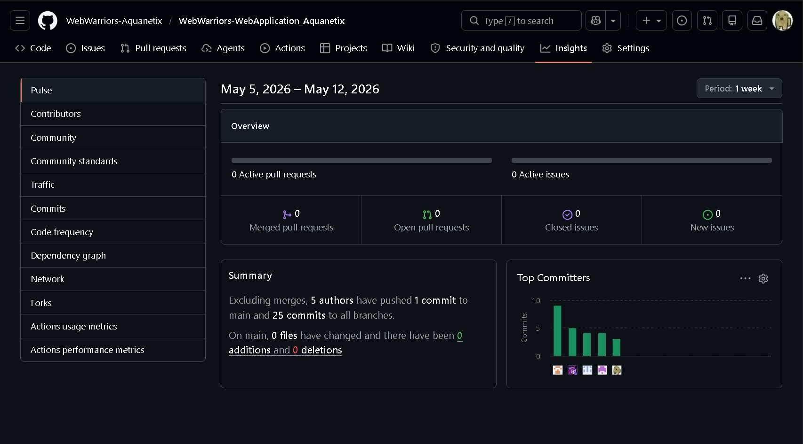
</p>

### 5.2.3. Sprint 3

#### 5.2.3.1. Sprint Planning 3.

| Campo / Sección | Detalle |
| :--- | :--- |
| Sprint # | Sprint 3 |
| Date | 2026-06-14 |
| Time | 9:00 PM |
| Location | Google meet |
| Prepared By | Castro Solorza, Nicolas Eduardo |
| Attendees (to planning meeting) | Pinedo Sánchez, Sebastián Martín / Castro Solorza, Nicolás Eduardo / Cochachi Chagua, Sebastián Josué / Cabrera Novoa, Leonardo Moisés / Bojórquez Bustinza, Renzo Alejandro |
| Sprint 3  Review Summary | Durante el sprint 3, se logro desplegar la arquitectura backend de la aplicacion web, y crear los endpoints relacionados a los bounded context identificados. Asimismo, se corrigieron varias observaciones identificadas tanto en la Landing Page como en la aplicacion frontend. El Product Owner aprobo la estructura inicial, mas recomendo poner un mayor enfasis en la interaccion de backend con el frontend. |
| Sprint 3  Retrospective Summary | El equipo identifico como acierto verificar la funcionalidad de los endpoints antes de subirlos al repositorio. Sin embargo, como oportunidad de mejora, se identifico implementar el uso de GitFlow en nuestro proyecto para trabajar de manera mas ordenada.|
| Sprint 3 Goal |Nuestro enfoque está en ofrecer información detallada y real para los visitantes, facilidad de monitoreo y manejo de almacenamiento para las empresas suscritas a la plataforma, y aumentar las posibilidades para nuevos features para los desarrolladores.<br>Creemos que esto proporcionará una Landing Page atractiva para los visitantes, una aplicación de monitoreo estable para las empresas, y un entorno de desarrollo estable para los desarrolladores.<br>Esto se confirmará cuando los visitantes puedan ingresar a la plataforma directamente desde la Landing Page, las empresas puedan actualizar y ver los datos logisticos, obtenidos dinamicamente de la base de datos, sin depender de datos codificados; y cuando los desarrolladores puedan implementar nuevos features desde los endpoints existentes con facilidad.|
| Sprint 3 Velocity |Para este Sprint 3, evaluando el desempeño previo, capacidad actual del equipo, y circunstancias actuales de tiempo, se establecio un Velocity de 112 Story Points.|
| Sum of Story Points | 112 |
#### 5.2.3.2. Aspect Leaders and Collaborators.
En esta sección se presenta la matriz de liderazgo y colaboración (LACX), donde se definen los roles de cada integrante del equipo en los distintos aspectos considerados dentro del Sprint.

Los aspectos seleccionados corresponden a las principales áreas del proyecto Aquanetix, incluyendo desarrollo de la web application, Web Platform, la documentación y modelado del sistema.

| Team Member (Last Name, First Name) | GitHub Username | Web Application | Web Platform | Documentation | Modeling |
|------------------------------------|----------------|-------------|-------------|--------------|----------|
| Bojórquez Bustinza, Renzo Alejandro | DeterminedSoul7 | C | C | L | L |
| Cabrera Novoa, Leonardo Moisés | u202415820 | C | L | C | C |
| Castro Solorza, Nicolás Eduardo | NicoCSE | L | C | C | C |
| Cochachi Chagua, Sebastian Josue | sebastiancochachi02-cmd | C | C | C | C |
| Pinedo Sanchez, Sebastián Martín | smp1107 | L | C | C | C |

#### 5.2.3.3. Sprint Backlog 3.

El objetivo de este sprint backlog 3 fue la asignación de tareas relacionadas al servicio backend de nuestra plataforma en lo que refiere a métodos HTTP: GET, PUT, POST y DELETE. Se asignó un líder por cada bounded context para el desarrollo de cada endpoint, asegurándonos de que se cumplan las Technical Stories especificadas. Asimismo, se levantaron las observaciones identificadas tanto en la Landing Page como en la aplicación frontend.

Durante este Sprint, el equipo trabajó de manera colaborativa en la implementación de los diversos endpoints del servicio backend.

<div align="center">
  
  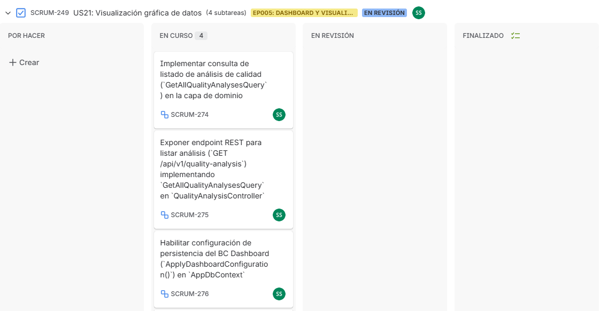
  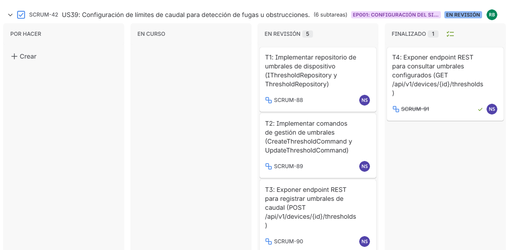
  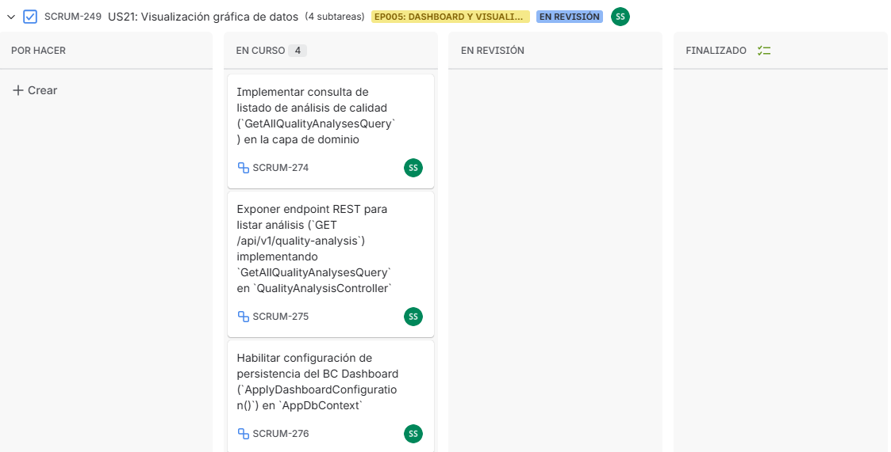
  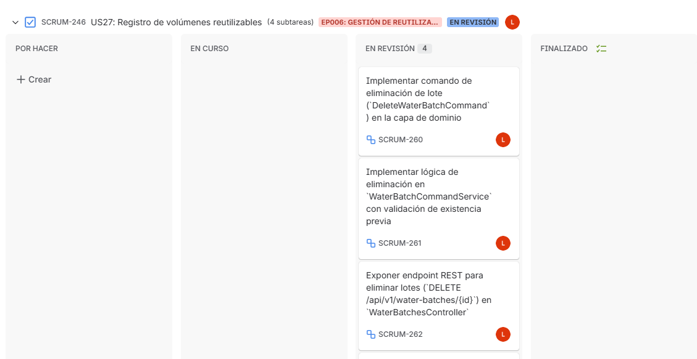
</div>

Enlace a la herramienta utilizada: https://shorturl.at/xs1Pv

A continuación, se detallan las User Stories priorizadas y las tareas asociadas:


| US Id | Title | Task Id | Task Title | Description | Estimation (Hours) | Assigned To | Status |
|------|------|--------|------------|------------|-------------------|-------------|--------|
| US-03 | Ajuste de frecuencia de monitoreo | T-01 | Exponer endpoint de tipo PUT | Exponer endpoint REST implementando comando de actualización (PUT/api/v1/devices/{id}) en DevicesController | 5 | Renzo Bojórquez | Done |
| US-21 | Visualización gráfica | T-02 | Exponer endpoint de tipo GET | Exponer endpoint REST para listar análisis ('GET/api/v1/quality-analysis') implementando 'GetAllQualityAnalysesQuery' en 'QualityAnalysisController'  | 4 | Sebastián Pinedo | Done |
| US-39 | Configuración de límites de caudal para detección de fugas u obstruccciones. | T-03 | Exponer endpoint de tipo POST | Exponer endpoint REST para registrar umbrales de caudal ('GET/api/v1/devices/{id}/thresholds') | 6 | Nicolás Castro | Done |
| US-01 | Suscripción automatizada y control de acceso. | T-04 | Prueba de registro de suscripciones | Insertar datos de prueba en tabla 'subscriptions' para validar el endpoint ('GET/api/v1/subscriptions/{id}')| 5 | Sebastián Cochachi | Done |
| US-27 | Registro de volúmenes reutilizables | T-05 | Exponer endpoint de tipo DELETE | Exponer endpoint REST para eliminar lotes {'DELETE/api/v1/water-batches/{id}'} en 'WaterBatchesController'| 4 | Leonardo Cabrera| Done |

#### 5.2.3.4. Development Evidence for Sprint Review.

| Repository | Branch | Commit Ids | Commit Message | Commit Message Body | Committed on (Date) |
|------------|--------|-----------|----------------|---------------------|---------------------|
| aquanetix_platform | feature/get-all-devices | 7c8bad665184224272dd8a07fbf80f5c6c129def | feat(get-all-devices): add get all devices query. |  | 16/06/2026 |
| aquanetix_platform | feature/get-all-quality-analyses | 7be44256f1cdf815b9eca3611f5311138886f647 | feat: implement GetAllQualityAnalyses query and endpoint |  | 17/05/2026 |
| aquanetix_platform | feature/get-all-alerts | 77026adc3d13ad0c6072a74fcf81d430e6155eca | feat(monitoring): implement GetAllAlerts query and endpoint |  | 17/06/2026 |
| aquanetix_platform | feature/get-subscription-by-id | 29187e7120e7fe903b80af4d66975ce7624cabba | feat(subscription): implement create subscription and get subscription by id |  | 16/06/2026 |
| aquanetix_platform | feature/delete-water-batch | 53f8ddc14c1a8325a3597c8b538ac46499378ef2 | feat(service-design): add DeleteWaterBatch endpoint and command for deleting water batch entries |  | 15/06/2026 |

#### 5.2.3.5. Execution Evidence for Sprint Review.
En esta sección se presentan evidencias de la ejecución de la web platform y sus respectivos endpoints desarrollado durante el Sprint .

Las siguientes capturas muestran los endpoints validados y desplegados en un servidor en la nube la web platform posea funcionalidad.

**Figura 1. Endpoints del Bounded Context Monitoring**
<div align="center">
  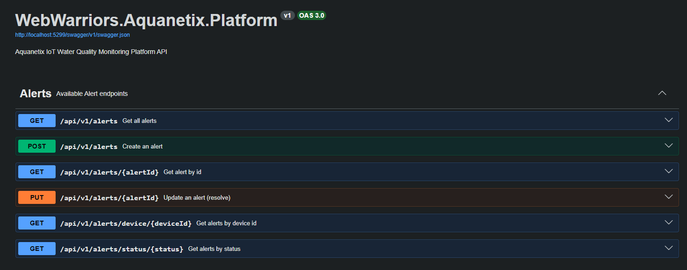
</div>
En esta imagen, se visualiza todas las acciones que se realiza en los endpoints de Alerts. Dichas acciones permiten visualizar todas las alertas disponibles, buscar una alerta por su ID, buscar una alerta por el ID del dispositivo, buscar una alerta por su estado, crear una alerta y actualizar una alerta.

**Figura 2. Endpoints del Bounded Context Devices**
<div align="center">
  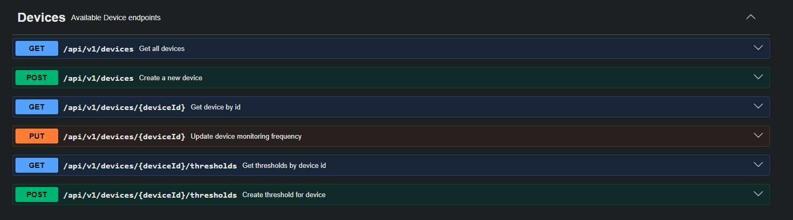
</div>
 En esta imagen, se visualiza todas las acciones que se realiza en los endpoints de Devices. Dichas acciones permiten visualizar todas los dispositivos disponibles, buscar una dispositivo por su ID, buscar un limite mediante el ID del dispositivio,crear un límite para un dispositivo, crear un nuevo dispositivo y actualizar la frecuencia de monitoreo de un dispositivo.

**Figura 3. Endpoints del Bounded Context Dashboard**
<div align="center">
  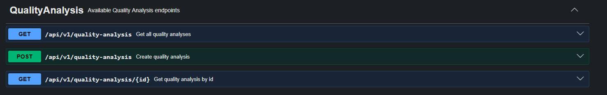
</div>
En esta imagen, se visualiza todas las acciones que se realiza en los endpoints de QualiyAnalysis. Dichas acciones permiten obtener todos las consultas de análisis, crear una consulta de análisis y obtener una consulta de analisis mediante su ID.


**Figura 4. Endpoints del Bounded Context Suscriptions**
<div align="center">
  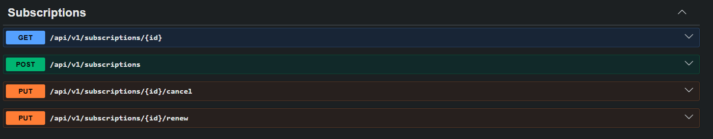
</div>
En esta imagen, se visualiza todas las acciones que se realiza en los endpoints de Suscriptions. Dichas acciones permiten obtener una suscripción mediante su ID, cancelar una suscripcion, renovar una suscripción y obtener una nueva suscripción.

**Figura 5. Endpoints del Bounded Context Management**
<div align="center">
  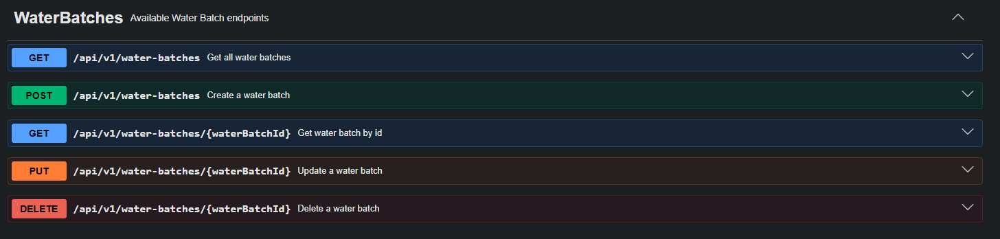
</div>
En esta imagen, se visualiza todas las acciones que se realiza en los endpoints de WaterBatches. Dichas acciones permiten obtener todos los lotes de agua registrados, crear un lote de agua, obtener un lote de agua mediante su ID, actualizar los datos de un lote de agua y eliminar un lote de agua.

**Figura 6. Base de Datos subida a la nube mediante Aiven**
<div align="center">
  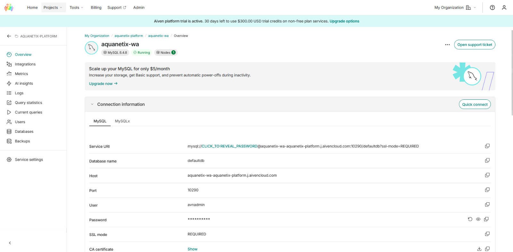
</div>
En esta imagen se observa el resultado de subir la base de datos de nuestra Web Platform en la nube mediante la plataforma Aiven. Gracias a esto se automatiza la administración, seguridad, respaldos y escalabilidad de la infrsestructura  de nuestra plataforma web.

**Figura 7. Despliegue del backend de la Web Application en Render**
<div align="center">
  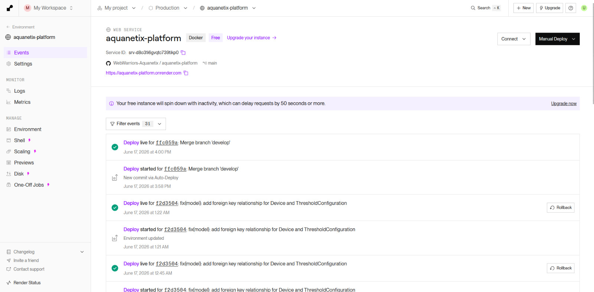
</div>
En esta imagen se observa el resultado de desplegar el backend de nuestra web application en Render. Esto fue fundamental debido a que se automatiza la configuración de servidores y el despliegue continuo de nuestro código.

#### 5.2.3.6. Services Documentation Evidence for Sprint Review.
Durante el Sprint 3, el equipo consolidó la documentación de los Web Services de la plataforma Aquanetix utilizando OpenAPI (Swagger), generada automáticamente a partir de las anotaciones `SwaggerTag`, `SwaggerOperation` y `SwaggerResponse` incorporadas en cada controlador de la API. El alcance de este Sprint comprendió la documentación de los endpoints de los cinco Bounded Contexts del backend (ServiceDesign, Monitoring, Devices, Dashboard y Subscription), así como la incorporación del nuevo endpoint de creación de dispositivos (`POST /api/v1/devices`) y la documentación de los sub-recursos de configuración de umbrales (thresholds). La documentación se encuentra desplegada y accesible públicamente a través de la interfaz Swagger UI del servicio desplegado en Render.

La especificación OpenAPI completa puede consultarse en los siguientes enlaces:

- **Swagger UI (documentación interactiva):** https://aquanetix-platform.onrender.com/swagger
- **Especificación OpenAPI (JSON):** https://aquanetix-platform.onrender.com/swagger/v1/swagger.json

A continuación se presenta la relación de endpoints documentados con OpenAPI durante este Sprint, indicando para cada acción el verbo HTTP, la sintaxis de llamada, los parámetros esperados y la respuesta correspondiente.

## Tabla de endpoints documentados

| Bounded Context | Acción | Verbo HTTP | Sintaxis de llamada | Parámetros | Ejemplo de Request | Response |
|---|---|---|---|---|---|---|
| ServiceDesign | Listar lotes de agua | GET | `/api/v1/water-batches` | — | `GET /api/v1/water-batches` | `200 OK` · `WaterBatchResource[]` |
| ServiceDesign | Obtener lote por id | GET | `/api/v1/water-batches/{id}` | `id` (path, int) | `GET /api/v1/water-batches/1` | `200 OK` · `WaterBatchResource` / `404` |
| ServiceDesign | Crear lote de agua | POST | `/api/v1/water-batches` | Body `CreateWaterBatchResource` | `{ "certificationCode": "WB-2026-001", "destinationSectorId": 3, "volumeLiters": 1200.5, "deliveryTimestamp": "2026-06-18T10:00:00Z", "status": "Certified", "source": "Plant A" }` | `201 Created` · `WaterBatchResource` |
| ServiceDesign | Actualizar lote | PUT | `/api/v1/water-batches/{id}` | `id` (path) + Body `UpdateWaterBatchResource` | `PUT /api/v1/water-batches/1` | `200 OK` / `404` |
| ServiceDesign | Eliminar lote | DELETE | `/api/v1/water-batches/{id}` | `id` (path, int) | `DELETE /api/v1/water-batches/1` | `204 No Content` / `404` |
| Monitoring | Listar alertas | GET | `/api/v1/alerts` | — | `GET /api/v1/alerts` | `200 OK` · `AlertResource[]` |
| Monitoring | Obtener alerta por id | GET | `/api/v1/alerts/{id}` | `id` (path, int) | `GET /api/v1/alerts/5` | `200 OK` · `AlertResource` / `404` |
| Monitoring | Alertas por dispositivo | GET | `/api/v1/alerts/device/{deviceId}` | `deviceId` (path, int) | `GET /api/v1/alerts/device/2` | `200 OK` · `AlertResource[]` |
| Monitoring | Alertas por estado | GET | `/api/v1/alerts/status/{status}` | `status` (path, string) | `GET /api/v1/alerts/status/Active` | `200 OK` · `AlertResource[]` |
| Monitoring | Crear alerta | POST | `/api/v1/alerts` | Body `CreateAlertResource` | `{ "deviceId": 2, "type": "Turbidity", "severity": "Warning", "message": "...", "value": 8.0, "threshold": 6.0 }` | `201 Created` · `AlertResource` |
| Monitoring | Actualizar alerta | PUT | `/api/v1/alerts/{id}` | `id` (path) + Body `UpdateAlertResource` | `PUT /api/v1/alerts/5` | `200 OK` / `404` |
| Devices | Listar dispositivos | GET | `/api/v1/devices` | — | `GET /api/v1/devices` | `200 OK` · `DeviceResource[]` |
| Devices | Obtener dispositivo por id | GET | `/api/v1/devices/{deviceId}` | `deviceId` (path, int) | `GET /api/v1/devices/1` | `200 OK` · `DeviceResource` / `404` |
| Devices | Crear dispositivo | POST | `/api/v1/devices` | Body `CreateDeviceResource` | `{ "ownerId": 1, "serialNumber": "SN-PH-007", "deviceType": "PH", "name": "SN-PH-007", "location": "Planta Norte", "unit": "pH", "currentValue": 7.2 }` | `201 Created` · `DeviceResource` |
| Devices | Actualizar dispositivo | PUT | `/api/v1/devices/{deviceId}` | `deviceId` (path) + Body `UpdateDeviceResource` | `PUT /api/v1/devices/1` | `200 OK` · `DeviceResource` / `404` |
| Devices | Listar umbrales de un dispositivo | GET | `/api/v1/devices/{deviceId}/thresholds` | `deviceId` (path, int) | `GET /api/v1/devices/1/thresholds` | `200 OK` · `ThresholdResource[]` |
| Devices | Crear umbral de un dispositivo | POST | `/api/v1/devices/{deviceId}/thresholds` | `deviceId` (path) + Body `CreateThresholdResource` | `{ "minValue": 6.5, "maxValue": 8.5, "unit": "pH", "alertLevel": "Warning" }` | `201 Created` · `ThresholdResource` |
| Dashboard | Listar análisis de calidad | GET | `/api/v1/quality-analysis` | — | `GET /api/v1/quality-analysis` | `200 OK` · `QualityAnalysisResource[]` |
| Dashboard | Obtener análisis por id | GET | `/api/v1/quality-analysis/{id}` | `id` (path, int) | `GET /api/v1/quality-analysis/1` | `200 OK` · `QualityAnalysisResource` / `404` |
| Dashboard | Crear análisis de calidad | POST | `/api/v1/quality-analysis` | Body `CreateQualityAnalysisResource` | `POST /api/v1/quality-analysis` | `201 Created` · `QualityAnalysisResource` |
| Subscription | Obtener suscripción por id | GET | `/api/v1/subscriptions/{id}` | `id` (path) | `GET /api/v1/subscriptions/1` | `200 OK` · `SubscriptionResource` / `404` |
| Subscription | Crear suscripción | POST | `/api/v1/subscriptions` | Body `CreateSubscriptionResource` | `POST /api/v1/subscriptions` | `201 Created` · `SubscriptionResource` |
| Subscription | Cancelar suscripción | PUT | `/api/v1/subscriptions/{id}/cancel` | `id` (path) | `PUT /api/v1/subscriptions/1/cancel` | `200 OK` / `404` |
| Subscription | Renovar suscripción | PUT | `/api/v1/subscriptions/{id}/renew` | `id` (path) | `PUT /api/v1/subscriptions/1/renew` | `200 OK` / `404` |

> Todos los endpoints aceptan un `CancellationToken` y devuelven respuestas de error estandarizadas mediante `ProblemDetailsFactory`. Los enumerados (`DeviceType`, `DeviceStatus`, `AlertLevel`, etc.) se serializan como cadena en los recursos de respuesta para facilitar su lectura desde el cliente.


#### 5.2.3.7. Software Deployment Evidence for Sprint Review.

Durante el Sprint 3, el equipo completó el despliegue de los componentes principales de la plataforma Aquanetix en proveedores cloud, abarcando los Web Services (backend), la Web Application (frontend) y la base de datos. El objetivo de este Sprint fue garantizar que la aplicación funcionara de extremo a extremo en entornos productivos: que el frontend desplegado consumiera datos reales del backend desplegado, y que este último persistiera la información en una base de datos gestionada en la nube. A continuación se describen las actividades de creación de cuentas, configuración de recursos en los proveedores cloud y configuración de los proyectos para la integración del despliegue.

 #### Arquitectura de despliegue

El despliegue de la plataforma se distribuye en tres servicios cloud independientes:

| Componente | Proveedor | Tecnología | URL |
|---|---|---|---|
| Web Services (Backend) | Render | Docker · ASP.NET Core 10 | https://aquanetix-platform.onrender.com/swagger |
| Web Application (Frontend) | Firebase Hosting | Vue 3 · Vite | https://aquanetix-deploy.web.app |
| Base de datos | Aiven | MySQL 8 | (privada, accedida vía connection string) |

 #### 1. Despliegue de la Base de Datos (Aiven — MySQL 8)

Durante Sprints previos, la base de datos se hospedaba en Filess.io con MySQL 5.7; sin embargo, dicho proveedor presentaba incompatibilidades con las conexiones asíncronas del proveedor `MySql.EntityFrameworkCore` de Oracle. Por este motivo, durante este Sprint se migró la base de datos al servicio gestionado de **Aiven con MySQL 8**, que ofrece soporte completo para conexiones SSL y mayor estabilidad.

Las actividades realizadas fueron:

1. Creación de la cuenta en Aiven y aprovisionamiento de un servicio MySQL 8 gestionado.
2. Obtención de la connection string con SSL requerido (`SslMode=Required`), host, puerto y credenciales del servicio.
3. Aplicación del esquema de base de datos mediante migraciones de Entity Framework Core (`dotnet ef database update`), incluyendo la nueva migración `AddDevicePresentationFields` de este Sprint, que añade las columnas `name`, `location`, `unit` y `current_value` a la tabla `devices`.
4. Verificación de la creación de las tablas (`devices`, `threshold_configurations`, `alerts`, `quality_analyses`, `water_batches`, `subscriptions`, `__EFMigrationsHistory`) y del registro de la migración en el historial.

 #### 2. Despliegue de los Web Services (Render — Docker)

El backend se desplegó en **Render** utilizando un contenedor Docker, conectado a la rama `main` del repositorio para despliegue continuo: cada vez que se realiza un merge a `main`, Render reconstruye y redespliega el servicio automáticamente.

Las actividades realizadas fueron:

1. Creación del servicio web en Render a partir del repositorio de GitHub, configurado para construir mediante el Dockerfile del proyecto.
2. Configuración de las variables de entorno del servicio, incluyendo la connection string hacia Aiven (gestionada como variable de entorno y no versionada en el repositorio por motivos de seguridad).
3. Habilitación de Swagger UI en todos los entornos, de modo que la documentación de la API sea accesible públicamente en producción.
4. Verificación del arranque del servicio mediante los logs de Render (`Your service is live`) y la respuesta exitosa de la especificación OpenAPI (`GET /swagger/v1/swagger.json → 200`).

> Durante el Sprint se gestionó adecuadamente un incidente de seguridad: GitHub Push Protection detectó una connection string con credenciales de Aiven en un commit. Se resolvió eliminando los archivos `appsettings.json` del control de versiones (añadiéndolos al `.gitignore`) y reescribiendo el historial del feature branch para no exponer secretos, siguiendo buenas prácticas de manejo de credenciales.


#### 3. Despliegue de la Web Application (Firebase Hosting)

El frontend, desarrollado en Vue 3 con Vite, se desplegó en **Firebase Hosting**. Durante este Sprint se reconfiguró la aplicación para que consumiera el backend real desplegado en Render (reemplazando los servicios mock utilizados previamente), apuntando las variables de entorno (`VITE_AQUANETIX_API_URL`) a la URL del servicio en Render.

Las actividades realizadas fueron:

1. Configuración del proyecto de Firebase y del hosting (`firebase.json`), estableciendo la carpeta `dist` (generada por `vite build`) como directorio público.
2. Reconfiguración de la capa de infraestructura del frontend para consumir los endpoints reales del backend, con mapeo de datos (assemblers) entre el contrato del backend y el modelo de la interfaz.
3. Generación del build de producción mediante `npm run build`.
4. Despliegue mediante `firebase deploy`, verificando la publicación exitosa (`Deploy complete!`) y la disponibilidad de la aplicación en la URL de hosting.
5. Verificación funcional de extremo a extremo: creación, edición y consulta de dispositivos desde el frontend desplegado, comprobando la persistencia real de los datos en la base de datos de Aiven a través del backend de Render.
#### 5.2.3.8. Team Collaboration Insights during Sprint.
Para el desarrollo de este tercer sprint, todos los miembros del equipo desarrollaron y colaboraron de manera activa y continua. De tal modo, se muestra como evidencia los insights de cada miembro del equipo.

<p align = "left">
   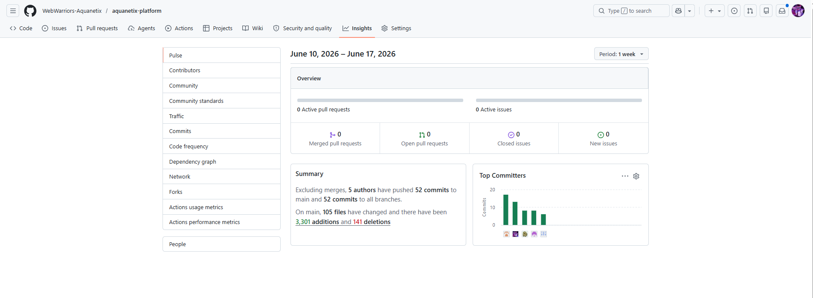
</p>

